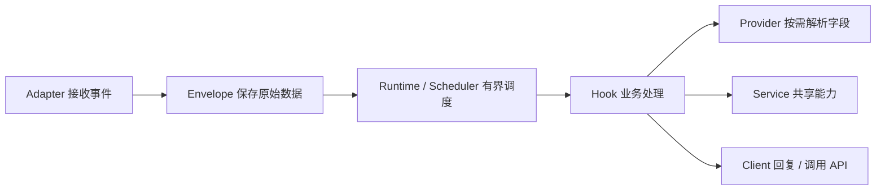
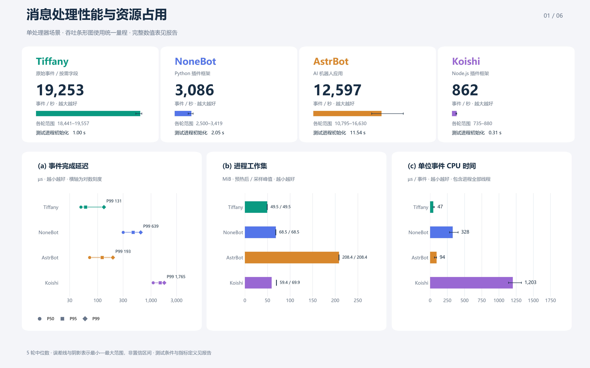

# Tiffany

**保留原始事件，按需读取字段，用 Hook 编写业务。**

Tiffany 是一个用 Python 编写的异步机器人运行时。接入层保存平台原始事件，核心负责路由、调度和资源生命周期；业务从一个异步函数开始，按需要组合字段、服务与扩展。

Python **3.11+** · **MIT** · 当前版本 **0.1.0**

[快速开始](#快速开始) · [核心设计](#核心设计) · [进阶扩展](#进阶扩展) · [性能实测](#性能实测) · [学习与开发](#学习与开发) · [文档导航](docs/README.md)

## 项目能做什么

| 接入方式 | 当前支持 | 启动入口 |
| --- | --- | --- |
| OneBot 反向 WebSocket | 接收事件、调用 API、回复消息；默认配置适配 NapCat | `bash start.sh` 首次选择 OneBot |
| QQ 官 Bot WebSocket | 群内 @消息、C2C 私聊的文本接收与回复；终端扫码配置 | `bash start.sh` 首次选择 QQ |
| 自定义事件源 | 构造 `Envelope`，经统一运行时分发给 Hook | `await bot.emit(envelope)` |

内置 `ping` 回复 `pong`，OneBot 与 QQ 官 Bot 共用业务 Hook。核心也可以独立使用，用于学习或构建自己的事件处理应用。

项目处于早期开发阶段，API 可能调整。QQ 官 Bot 已有本地假网关和 HTTP 服务测试，真实账号的权限、网关可用性和平台限制仍需实际联调；详见 [QQ 接入设计](docs/QQOFFICIAL_DESIGN.md)。

## 快速开始

Linux 服务器预装 Python 3.11+ 和 venv，然后在项目根目录启动。长期后台运行可使用 screen。

### 1. 安装

```bash
git clone https://github.com/CyanReef/Tiffany.git
cd Tiffany
bash start.sh
```

启动器首次安装带哈希锁定的服务器依赖，终端向导选择一种接入。配置、凭据、日志、业务数据和环境在项目的 `data/` 下生成；后续启动复用，不重写配置。也可执行 `screen -S tiffany bash /opt/Tiffany/start.sh`。

Windows 测试机安装 Python 3.11+ 后，在项目目录的 PowerShell 或 CMD 中执行：

```powershell
.\start.bat
```

首次同样进入配置向导；之后一行命令复用 `data/`。也可在 PowerShell 使用 `.\start.ps1`。两个入口支持 `configure`、`login`、`check-config`、`--home` 等相同参数，并自动寻找 Python；指定解释器和迁移到 Linux 的方法见 [部署文档](docs/DEPLOYMENT.md#windows-本机测试)。仅开发核心时仍可用 `python -m pip install -e .`；独立 Hook 示例无需服务器配置。

### 2. 连接 OneBot / NapCat

```bash
bash start.sh configure
bash start.sh check-config
bash start.sh
```

程序默认监听 `127.0.0.1:6199`。在 NapCat 或其他 OneBot 实现中启用**反向 WebSocket 客户端**，连接到 `ws://127.0.0.1:6199`，再向机器人发送 `ping`。

地址、端口、并发和共享缓冲预算在 `data/config/Tiffany.toml` 中设置，参考 [OneBot 示例](examples/Tiffany.onebot.toml)。Token 可在向导中隐藏输入；非本地绑定要求 Token。当前适配器支持一个活动连接。同一 `(adapter_id, session_id)` 内按接纳顺序执行；`workers = 1` 限制为单并发，跨会话仍按公平调度轮流执行，不保证整个连接的全局接收顺序。

### 3. 连接 QQ 官 Bot

```bash
# 在 configure 中选择 QQ 官 Bot，然后扫码或手动输入
bash start.sh configure
bash start.sh
# 需要重新绑定时
bash start.sh login
```

凭据与配置分离，默认保存到 `data/secrets/credentials.json`；配置指定的环境变量优先。首版使用一个账号、一个 WebSocket 连接；拿到 `READY` 后，测试群内 @机器人 `ping` 与私聊 `ping`。配置示例见 [Tiffany.qqofficial.toml](examples/Tiffany.qqofficial.toml)，协议边界见 [接入说明](docs/QQOFFICIAL_DESIGN.md)。

更新时 Ctrl+C 并等待清理结束，覆盖程序文件后再启动，保留 `data/`。发布包通过 `python -B tools/build_release.py` 生成并验证不含数据目录。环境按锁文件隔离以支持回滚；故障限次重启、日志轮转、健康检查和完整操作见 [服务器部署文档](docs/DEPLOYMENT.md)。

当前验证结果及实机验收待办见 [部署验证记录](docs/DEPLOYMENT_VALIDATION.md)。

## 写第一个 Hook

这个例子可独立运行，不需要机器人账号或外部服务。

```python
import asyncio

from core import Bot, Context, Envelope, Field

TEXT = Field[str]("demo.text")


async def main():
    bot = Bot()
    bot.provide(TEXT, lambda ctx: ctx.raw["text"].strip())

    @bot.hook(on="message", needs=(TEXT,))
    async def greet(ctx: Context):
        print(ctx.resolve(TEXT))

    async with bot:
        await bot.emit(Envelope("demo", {"text": " hello "}, kind="message"))


asyncio.run(main())  # 输出 hello
```

`needs` 声明依赖以便校验；真正调用 `ctx.resolve(TEXT)` 时才计算字段。同一事件的所有 Hook 共用缓存。接入真实平台后，可以在 Hook 中使用 `await ctx.reply("你好")` 回复，或直接读取 `ctx.raw` 中的平台特有数据。

`Field` 按对象身份区分，名称仅用于诊断。应在一个公共模块定义字段并导入同一实例；项目已有共享字段见 [fields.py](fields.py)。Provider 是同步计算函数；网络、数据库等异步调用放在 Hook 或 Service 中。

## 核心设计



| 设计选择 | 如何工作 |
| --- | --- |
| 保留原始数据 | `Envelope.raw` 保存平台事件；协议状态与控制帧由 Adapter 管理 |
| 按需计算 | `Context.resolve()` 在本事件内缓存字段，未读取的字段无需解析 |
| 先路由，再执行业务 | 按 `platform`、`kind` 筛选 Hook，缓存当前注册快照的路由 |
| 有界接纳 | Scheduler 共享事件数与估算占用预算，按需创建执行任务，过载时明确拒绝 |
| 按资源归属清理 | Scope 管理一组注册与资源，Runtime 监督任务并负责关闭 |

同一个会话键的事件串行处理，不同会话可以并行；实际顺序取决于 Adapter 提供的会话键。默认共享 **8192** 个在途事件、**64 MiB 估算占用预算**、最多 **64** 个执行任务；适配器继承全局并发，显式 `workers` 可降低上限。会话没有固定积压上限，单会话突发按共享余量接纳；总预算的 1/8 为低占用会话保留。估算预算不等于进程 RSS 上限，实际吞吐量取决于 Hook 工作量和外部 I/O。配置与接纳契约见 [弹性调度说明](docs/ELASTIC_SCHEDULING.md)。

## 进阶扩展

从一个 Hook 继续增加能力，无需改变基础事件模型。

| 想做什么 | 使用什么 |
| --- | --- |
| 提前执行过滤或权限判断 | `priority` 数值越大越先执行；`when` 支持同步或异步判断 |
| 组合派生字段 | `provide(..., requires=(...))` 声明依赖，Provider 内调用 `resolve()` |
| 为后续 Hook 共享本事件结果 | `ctx.put(field, value)`；`ctx.stop()` 停止后续 Hook |
| 复用数据库连接或 API 客户端 | 注册 `ServiceKey` 与 Service，通过 `ctx.service(key)` 获取 |
| 管理一组可卸载的业务 | `bot.scope("my.extension")` 注册 Hook、Provider、Service 和生命周期资源 |
| 控制错误与耗时 | `on_error="continue"` 或默认 `"abort"`，配合 `timeout`、`on_timeout` |
| 观察运行情况 | `bot.metrics`、可选 Trace 和 OpenMetrics 导出 |
| 使用平台独有能力 | 读取原始事件、自定义 Provider，或通过 Client 直接调用协议 API |

默认 `abort` 错误策略终止当前事件。Scope 卸载会处理其在途工作并撤销注册；共享依赖存在时会阻止错误卸载。资源生命周期、任务监督与完整示例见 [学习与开发路线](docs/LEARNING_GUIDE.md)。

## 性能实测

共享预算与按需调度的 [前后性能验收](docs/PERFORMANCE_ELASTIC.md) 使用实施前工作区源码作为基线，覆盖正常负载、HTTP 闭环、固定到达、突发排空和 30 分钟稳定性。报告保留逐轮数据、统计区间、未通过结果、源码快照及复测命令，区分功能完成与性能门槛是否通过。完整回归为 **234 项**，Windows 跳过 4 项；30 分钟周期性突发完成 **280,064** 条，排空后预算、任务和 owner 引用均归零。

**当前整体性能验收未通过。** 正常负载的 10 Hook 吞吐中位数回退 3.80%，五个核心场景的配对区间仍不能排除 3% 回退；5 ms / 64 会话的 HTTP 尾延迟及固定到达吞吐也未达门槛。功能与稳定性通过不代表性能保证已经达成，具体结果与测量限制见报告。

2026-10-06 的 [四框架离线消息处理基准](docs/FRAMEWORK_COMPARISON_REPRESENTATIVE.md) 使用更新后的 Tiffany 源码，比较 Tiffany、NoneBot、AstrBot、Koishi。六幅卡片式图表配有对应数值表，覆盖消息处理、规则与消息规模、HTTP I/O、当前默认突发接纳及完成、进程初始化与内存，以及 AstrBot 配置读取路径。每个框架有五次进程重复测量，保留指标方向提示、单位、中位数和最小–最大范围。报告提供指标定义、原始数据、源码快照和矢量图；结论限于所测源码的离线入口，上一轮结果另行归档。



历史代码检查、指标优化、三框架和六框架采样统一保存在 [历史报告索引](docs/archive/README.md)；核心微基准的方法见 [基准说明](docs/BENCHMARKS.md)。各批次分别保留来源、样本和未通过结果，不混用数字。

在自己的机器上复测时，将新数据与图表写入独立目录：

```powershell
python -m pip install -e ".[benchmark]"
python -B -m benchmarks.run --output .build-cache/benchmarks/local.json
python -B -m benchmarks.plot --input .build-cache/benchmarks/local.json --output .build-cache/benchmarks/plots
```

测量脚本使用标准库与项目核心，绘图使用可选依赖；更多工作负载和复测命令见 [基准工具导航](benchmarks/README.md)。

## 学习与开发

| 从哪里开始 | 文档 |
| --- | --- |
| 了解目录职责，跟踪一条消息 | [源码地图](docs/CODE_MAP.md) |
| 按阶段读代码，动手制作扩展 | [学习与开发路线](docs/LEARNING_GUIDE.md) |
| 找到单元测试、集成测试与辅助对象 | [测试目录导航](tests/README.md) |
| 理解 QQ 接入与协议边界 | [QQ 官 Bot 接入设计](docs/QQOFFICIAL_DESIGN.md) |
| 首次配置、screen、更新与回滚 | [服务器部署文档](docs/DEPLOYMENT.md) |
| 理解性能测试及其限制 | [基准说明](docs/BENCHMARKS.md) |
| 配置共享预算、同步接纳与公平调度 | [弹性调度说明](docs/ELASTIC_SCHEDULING.md) |
| 查看正常负载、高负载与稳定性验收 | [弹性调度性能报告](docs/PERFORMANCE_ELASTIC.md) |
| 查看指标/调度优化与前后验收 | [性能优化报告](docs/archive/PERFORMANCE_OPTIMIZATION.md) |
| 查看整体检查、引用释放与接纳优化 | [代码检查记录](docs/archive/CODE_AUDIT.md) |
| 了解 dsh 架构研究与设计启发 | [架构分析](docs/design/DSH_ARCHITECTURE_STUDY.md) |

目录按职责组织：`hooks/` 编写业务，`adapters/` 接收事件，`clients/` 执行平台动作，`core/` 提供平台无关的运行机制；`application.py` 负责将它们组装起来。`deployment/` 管理环境和应用进程，`shared/` 保存标准库路径约定。核心的大模块内部按 `core/dispatch/` 与 `core/runtime/` 分工，原有 `from core import ...` 入口保持可用。

### 运行测试

```powershell
# 安装完整测试使用的服务器依赖
python -m pip install --require-hashes --only-binary=:all: -r requirements-server.lock
python -m unittest discover -s tests -t . -q
```

测试使用标准库 `unittest`，按 `unit`、`integration` 和协议分类。QQ 自动集成测试启动本地假 HTTP 服务与 WebSocket 网关，无需真实账号。

### 参与贡献

欢迎提交 [Issue](https://github.com/CyanReef/Tiffany/issues) 和 Pull Request。问题反馈请附复现步骤、Python 版本与必要日志；改动请说明目的、行为变化和验证方式。业务扩展优先放在 Hook / Provider / Service 层；修改核心机制时补充对应行为测试，并更新相关文档。

## 开源许可

Tiffany 使用单份标准英文 [MIT License](LICENSE)。允许商用、修改和再分发，分发时保留版权与许可声明；软件按原样提供，不附带担保。第三方依赖遵循各自的许可。

许可条款对应 [SPDX 收录的 MIT 条款](https://spdx.org/licenses/MIT.html)。
