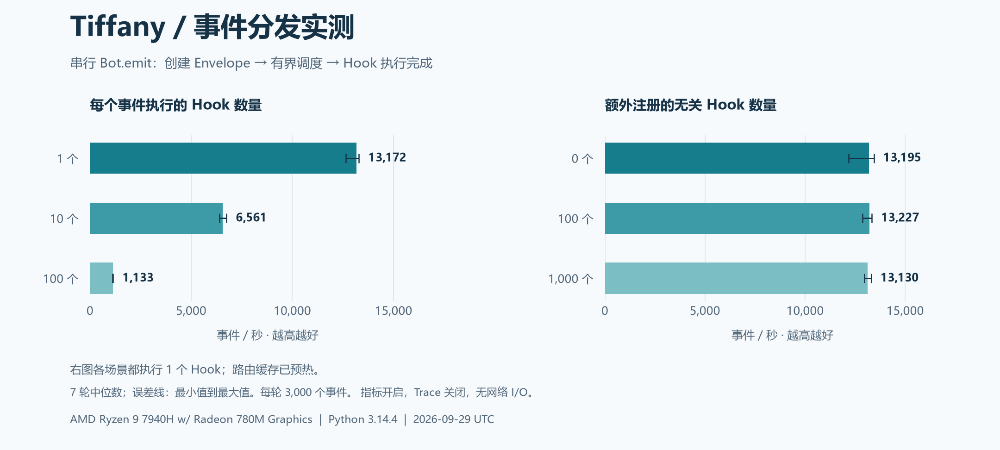
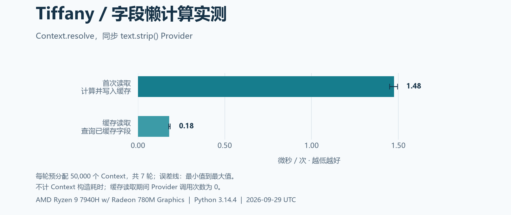

# Tiffany 性能基准

这份文档说明 [README](../README.md) 中图表的测量方法、实测结果与适用范围。数据来自实际执行，不使用推算值或其他框架的假定数据。

## 测试环境

| 项目 | 本次环境 |
| --- | --- |
| 测试时间 | 2026-09-30 06:20–06:21，UTC+8；JSON 与图表使用 2026-09-29 UTC |
| 系统 | Windows 11，构建 26100，AMD64 |
| CPU | AMD Ryzen 9 7940H，系统报告 16 个逻辑处理器 |
| Python | CPython 3.14.4，Anaconda 构建 |
| 事件循环 | Windows 默认 `ProactorEventLoop`，单进程、单事件循环 |
| 依赖 | websockets 16.0；Matplotlib 3.11.2 仅用于事后绘图 |
| 运行状态 | asyncio debug 关闭，GC 保持开启；指标开启，Trace 关闭 |
| 样本 | 每种场景 7 轮；分发每轮 3,000 个事件；字段每轮 50,000 个 Context |
| 预热 | 每个场景、每轮先执行 200 次，不计入测量 |

测试时包含尚未提交的源码改动，Git HEAD 不能独立标识被测版本。[原始 JSON](../benchmarks/results/local.json) 记录 HEAD、工作区状态及 `core/*.py` 和测量脚本内容的合并 SHA-256，便于识别不同版本。

这是普通开发机器上的一次采样，未设置 CPU 亲和性或锁定频率，也没有隔离系统后台负载。结果保留波动范围，便于判断量级。

## 事件分发



[中文 SVG](assets/performance/dispatch.zh-CN.svg) · [English PNG](assets/performance/dispatch.png) · [English SVG](assets/performance/dispatch.svg)

### 如何测量

每个场景创建独立 Bot，注册 Hook、启动并预热后，依次执行：

```python
await bot.emit(Envelope("benchmark", {"text": "hello"}, kind="message"))
```

计时覆盖原始字典与 Envelope 创建（包括默认事件 ID）、Runtime 接纳、Scheduler 调度、Context 创建、Hook 执行与指标记录，直到 `emit()` 返回。启动、注册、预热与关闭不在计时范围内。

每个匹配的异步 Hook 只递增处理计数，不执行 I/O，也不解析字段。所有 Hook 使用相同 owner；结束后检查总调用次数。事件按顺序提交并等待完成，因此这是单生产者串行往返测量，没有压满队列或启用多个并发生产者。

左图改变实际执行的 Hook 数量；右图固定 1 个 `message` Hook，额外注册 0、100、1,000 个不匹配的 `notice` Hook。路由缓存在预热时建立，注册表在测量期间保持不变。

### 本次结果

以下数值来自 JSON，取各轮吞吐量的中位数。范围为各轮最小值到最大值，图中误差线也表示这个范围，**并非置信区间**。

| 场景 | 匹配 Hook | 无关 Hook | 中位吞吐量（事件/秒） | 最小–最大（事件/秒） |
| --- | ---: | ---: | ---: | ---: |
| 匹配数量：1 | 1 | 0 | 13,172 | 12,634–13,295 |
| 匹配数量：10 | 10 | 0 | 6,561 | 6,407–6,746 |
| 匹配数量：100 | 100 | 0 | 1,133 | 1,118–1,143 |
| 无关数量：0 | 1 | 0 | 13,195 | 12,171–13,439 |
| 无关数量：100 | 1 | 100 | 13,227 | 12,880–13,334 |
| 无关数量：1,000 | 1 | 1,000 | 13,130 | 12,970–13,305 |

两个仅含 1 个 Hook 的基线分别采样，细小差异属于本次测量波动。脚本在各轮轮换场景顺序，减轻固定执行顺序的影响。

**怎样理解：**真正执行的 Hook 越多，处理与指标记录的成本越高。本次预热后的路由测试中，无关 Hook 数量从 0 增加到 1,000，吞吐量仍约为 1.3 万事件/秒；这与当前缓存匹配路由的实现一致。注册开销、首次选路、注册表变更及历史快照的重新匹配均未包含在这一结论中。

## 字段首次读取与缓存读取



[中文 SVG](assets/performance/fields.zh-CN.svg) · [English PNG](assets/performance/fields.png) · [English SVG](assets/performance/fields.svg)

### 如何测量

使用一个同步 Provider，读取 `ctx.raw["text"].strip()`，并计数以验证调用次数。输入为 `"  hello  "`。提前分配 50,000 个不同的 Context，它们共享只读使用的原始 Envelope，拥有各自的字段缓存。

两种场景使用相同的遍历方式，每个 Context 在计时区间调用一次 `resolve()`：

- **首次读取：**缓存为空，包含 Provider 查找、调用、计数、文本处理和缓存写入。
- **缓存读取：**在计时开始前填充缓存，计时区间只读取已缓存字段。

Context 分配、缓存预填充、验证和主动 GC 不在计时范围内；正常自动 GC 仍开启。两种场景在各轮交换先后顺序。

| 场景 | 每次读取耗时中位数 | 各轮范围 | 每轮计时区间内 Provider 调用次数 |
| --- | ---: | ---: | ---: |
| 首次读取 | 1.476 µs | 1.449–1.494 µs | 50,000 |
| 缓存读取 | 0.180 µs | 0.176–0.184 µs | 0 |

**怎样理解：**同一事件中多个 Hook 读取同一个字段时，可以复用第一次计算的结果。这组数值包含特定 Provider 的工作量和 Python 循环开销，不能当作所有 Provider 的固定成本，也不能直接换算为整个机器人的提速比例。

## 测量范围

这组微基准用于理解分发路径、匹配路由和字段缓存。它没有测量 WebSocket 收包、JSON 解码、QQ 鉴权、HTTP 回复、平台限流、真实业务逻辑、内存峰值、过载恢复或多会话并发吞吐量。

结果受 Python 版本、操作系统、事件循环和 CPU 状态影响。本次只在上述环境运行；单轮平均耗时不能表示单个事件的 P95/P99 延迟，也没有其他框架或历史版本的对照数据。应用选型应结合自己的消息负载和 I/O 延迟实测。

## 如何复测

在源码仓库根目录、激活虚拟环境后运行：

```powershell
# 只采集结果：使用标准库与项目核心
python -m pip install -e .
python -m benchmarks.run

# 可选：安装绘图库并生成 PNG / SVG
python -m pip install -e ".[benchmark]"
python -m benchmarks.plot
```

默认会覆盖仓库里的 `benchmarks/results/local.json` 和 `docs/assets/performance/`。需要保留已有结果时，指定输出位置：

绘图默认生成简体中文与英文两个版本。中文绘图需要系统安装微软雅黑、思源黑体、Noto Sans CJK SC 等中文字体；已有 PNG / SVG 可直接查看。只生成英文时使用 `python -m benchmarks.plot --language en`，只生成中文时使用 `--language zh-CN`。

```powershell
python -m benchmarks.run --events 10000 --contexts 50000 --warmup 1000 --repeats 9 --output .venv/benchmark-results/mine.json
python -m benchmarks.plot --input .venv/benchmark-results/mine.json --output .venv/benchmark-results/charts
```

| 参数 | 默认值 | 含义 |
| --- | ---: | --- |
| `--events` | 3,000 | 每轮每种分发场景的事件数 |
| `--contexts` | 50,000 | 每轮每种字段场景的 Context 数 |
| `--warmup` | 200 | 每轮每种场景的预热次数 |
| `--repeats` | 7 | 重复轮数 |
| `run --output` | `benchmarks/results/local.json` | 原始采样与汇总结果 |
| `plot --input` | `benchmarks/results/local.json` | 绘图数据来源 |
| `plot --output` | `docs/assets/performance/` | PNG / SVG 保存目录 |

测量代码见 [run.py](../benchmarks/run.py)，绘图代码见 [plot.py](../benchmarks/plot.py)。图表不会再次执行基准，而是读取已经保存的 JSON。修改代码后请重新采样；发布新的图表时，同时更新原始结果和本文的环境、数值说明。
