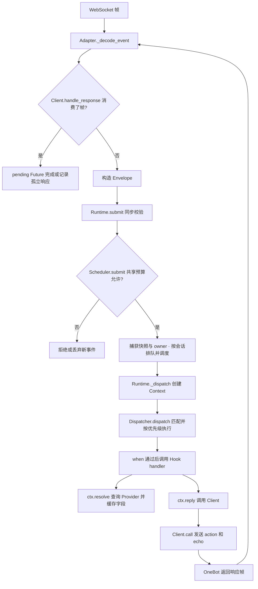

# Tiffany 源码地图

这份地图按当前源码说明“各部分做什么、调用如何经过它们、继续开发应改哪里”。基础运行方式见 [README](../README.md)，学习顺序见 [学习与开发路线](LEARNING_GUIDE.md)。

## 1. 项目按职责分层

```text
Tiffany/
├── start.sh / start.bat / start.ps1  # Linux / Windows 一行启动
├── launcher.py             # 标准库服务器入口
├── main.py                 # 启动程序
├── application.py          # 组装 Bot、业务和适配器
├── settings.py             # 读取和校验配置
├── LICENSE                 # 唯一项目许可证，标准英文 MIT
├── fields.py               # 应用和协议共用的 Field 实例
├── hooks/                  # 业务功能与派生字段
├── adapters/               # 外部事件接入
├── clients/                # 外部动作调用与回复
├── core/                   # 平台无关的框架能力
│   ├── dispatch/           # 注册、路由、Hook 执行的内部实现
│   └── runtime/            # 启动、关闭、组件调用、Scope 资源的内部实现
├── shared/                 # 只依赖标准库的跨层路径约定
├── deployment/             # 环境准备、配置向导和进程监督
├── examples/               # 配置与独立应用示例；legacy/ 保存旧配置
├── data/                   # 首次启动生成，更新包排除
├── tests/                  # 单元、集成测试与测试辅助对象
├── benchmarks/             # 可复现的性能采样、原始结果与绘图脚本
└── docs/                   # README 导航、现行说明、design/、planning/、archive/
```

| 分类 | 文件 | 职责与阅读入口 |
| --- | --- | --- |
| 启动 | [main.py](../main.py) | 调用 `TiffanyApplication.run()` |
| 组合 | [application.py](../application.py) | `_create_bot()` 注册业务；`_run()` 加载配置、安装适配器、运行 Bot |
| 配置 | [settings.py](../settings.py)、[部署模块](../deployment) | `load_config()` 默认解析 data/config/Tiffany.toml；凭据读取由独立解析器完成 |
| 服务器 | [launcher.py](../launcher.py)、[start.sh](../start.sh)、[start.bat](../start.bat)、[start.ps1](../start.ps1) | 首次向导、环境隔离、进程锁、信号和重启监督；操作见 [部署说明](DEPLOYMENT.md) |
| 字段约定 | [fields.py](../fields.py) | 集中定义 `TEXT`、`USER_ID` 等共享字段键，供协议 Provider 和业务一起使用 |
| 构建与依赖 | [pyproject.toml](../pyproject.toml)、[requirements.txt](../requirements.txt) | Python 版本、打包模块、MIT 许可元数据、基础与可选依赖 |
| 性能采样 | [run.py](../benchmarks/run.py)、[plot.py](../benchmarks/plot.py) | 分发与字段读取微基准；方法和结果见 [基准说明](BENCHMARKS.md) |
| 框架多维测量 | [协调器](../benchmarks/representative/run.py)、[源码边界](../benchmarks/representative/sources.py)、[场景](../benchmarks/representative/cases.py)、[HTTP 服务](../benchmarks/representative/server.py) | 保存生产源码快照并核验实际导入路径；独立进程采样、原生输入、共享高精度 I/O 延迟与突发场景 |
| 框架原生接入 | [Python 接入](../benchmarks/representative/engines.py)、[Python worker](../benchmarks/representative/worker.py)、[Koishi worker](../benchmarks/representative/koishi.cjs) | 保留原生解析和调度，核验处理/规则/字符/HTTP/指标计数 |
| 框架结果交付 | [校验](../benchmarks/representative/validate.py)、[展示条件](../benchmarks/representative/presentation.py)、[绘图](../benchmarks/representative/plot.py)、[报告](../benchmarks/representative/report.py) | 图表与数值表共用场景定义，六幅卡片式图表覆盖比较维度，保留单位、范围和图注；方法见 [离线消息处理基准](FRAMEWORK_COMPARISON_REPRESENTATIVE.md) |
| 历史框架对比 | [compare_expanded.py](../benchmarks/compare_expanded.py)、[expanded_engines.py](../benchmarks/expanded_engines.py)、[Koishi worker](../benchmarks/koishi_worker.cjs)、[绘图](../benchmarks/plot_expanded.py) | 保留六框架原生路径与此前采样；方法见 [六框架报告](archive/FRAMEWORK_COMPARISON_EXPANDED.md) |

组合发生在应用层。业务 Hook 使用 `core` 和共享字段，Adapter 负责协议转换，Client 负责协议动作；`core` 不导入 `hooks`、`adapters`、`clients` 或 `deployment`。`shared` 只依赖标准库，核心和部署都可以使用它。启动器不导入 `core` 或第三方包，能在应用环境安装前运行；这个边界由 [分层隔离测试](../tests/unit/core/test_layering.py) 验证。

## 2. core 内部的五类职责

公开 API 已在 [core/__init__.py](../core/__init__.py) 中按下面五类组织。使用框架时可以从 `from core import Bot, Envelope, Field` 开始，再按需要进入具体实现。

### 2.1 开发入口

| 文件 | 负责什么 | 先看哪些方法 | 对应测试 |
| --- | --- | --- | --- |
| [Bot.py](../core/Bot.py) | 协调注册表和 Runtime，为开发者提供统一入口 | `hook`、`provide`、`service`、`emit`、`unload` | [分发](../tests/integration/core/test_dispatcher.py)、[Scope](../tests/integration/core/test_scope.py) |
| [Scope.py](../core/Scope.py) | 为一组注册确定 owner 和活动状态 | `register_hook`、`provide`、`service`、`lifespan`、`unload` | [Scope](../tests/integration/core/test_scope.py) |
| [__init__.py](../core/__init__.py) | 导出公共对象，并按职责归类 | 分组导入与 `__all__` | 各模块通过公共入口使用框架 |

`Bot` 适合写一个完整应用；`Scope` 适合把某个扩展的 Hook、Provider、Service 和生命周期资源作为整体管理。

### 2.2 事件模型与分发

| 文件 | 负责什么 | 关键点 | 对应测试 |
| --- | --- | --- | --- |
| [Envelope.py](../core/Envelope.py) | 保存原始事件、路由和连接/会话元数据 | 原始 `raw` 不做全量平台解析 | [协议字段](../tests/unit/onebot/test_fields.py)、[适配器接入](../tests/unit/onebot/test_adapter.py) |
| [Context.py](../core/Context.py) | 为一次事件提供字段缓存、服务查询和回复入口 | `resolve`、`put`、`service`、`reply`、`stop` | [字段解析](../tests/unit/core/test_context.py)、[Ping](../tests/integration/hooks/test_ping.py) |
| [Field.py](../core/Field.py) | 定义带类型的数据键 | 按对象身份区分；名称用于说明和诊断 | [字段解析](../tests/unit/core/test_context.py) |
| [Hook.py](../core/Hook.py) | 保存处理器、过滤、依赖、优先级和错误策略声明 | `needs` 声明不会主动解析字段 | [分发](../tests/integration/core/test_dispatcher.py)、[执行](../tests/integration/core/test_hook_execution.py) |
| [Dispatcher.py](../core/Dispatcher.py) | 保持公开分发入口，组合内部注册、路由与执行对象 | `dispatch` 捕获一份视图，按优先级调用 Hook | [句柄](../tests/integration/core/test_hook_handles.py)、[分发](../tests/integration/core/test_dispatcher.py)、[追踪](../tests/integration/core/test_trace.py) |

Dispatcher 的内部实现按下表阅读；业务继续使用 `core` 公共入口。

| 文件 | 职责 | 阅读入口 |
| --- | --- | --- |
| [dispatch/models.py](../core/dispatch/models.py) | 不可变声明、快照、控制句柄和执行异常 | `HookRegistration`、`HookSnapshot`、`HookHandle` |
| [dispatch/registry.py](../core/dispatch/registry.py) | 注册与变更、依赖声明、快照发布 | `HookRegistry.add`、`_publish`、`remove_owner` |
| [dispatch/routing.py](../core/dispatch/routing.py) | 有界路由缓存和历史快照选路 | `HookRouter._matching_route`；旧快照不进入当前缓存 |
| [dispatch/execution.py](../core/dispatch/execution.py) | 谓词和 handler 调用、超时/错误策略、指标与 Trace | `HookExecutor._execute`、`_finish_record` |

同一事件中的所有 Hook 共用一个 `Context`，所以解析出的值可以复用。`ctx.stop()` 停止后续 Hook，当前 Hook 自身的代码仍会继续执行。

### 2.3 注册与依赖

| 文件 | 负责什么 | 关键点 | 对应测试 |
| --- | --- | --- | --- |
| [Provider.py](../core/Provider.py) | 将 Field 与同步计算函数连接，校验字段依赖图 | `add`、`get`、`validate`；平台 Provider 优先于通用 Provider | [Provider 注册表](../tests/unit/core/test_provider_registry.py)、[字段解析](../tests/unit/core/test_context.py) |
| [Service.py](../core/Service.py) | 注册共享服务，确定服务依赖顺序 | `ServiceKey` 按身份区分；`lifecycle_order` 给出依赖顺序 | [Service 注册表](../tests/unit/core/test_service_registry.py)、[生命周期](../tests/integration/core/test_lifecycle.py) |
| [Paths.py](../core/Paths.py) | 导出路径类型及 `APP_PATHS` 服务键 | 应用显式注册路径服务，Hook 通过 `uses` 和 `ctx.service` 获取 | [分层与路径服务](../tests/unit/core/test_layering.py) |
| [Ownership.py](../core/Ownership.py) | 统一 owner 比较、字典键和去重规则 | 字符串 owner 按值比较，其他对象按身份比较；支持不可哈希 owner | [Scope](../tests/integration/core/test_scope.py)、[注册表](../tests/unit/core/test_provider_registry.py) |

| 需求 | 使用的对象 | 获取方式 |
| --- | --- | --- |
| 从当前事件计算一个值 | `Field` + Provider | `ctx.resolve(field)` |
| 使用跨事件共享的能力或连接 | `ServiceKey` + Service | `ctx.service(key)` |
| 执行异步业务处理 | Hook | 异步 handler，通过 `ctx` 访问数据和能力 |

Provider 接收的是受限的 `ProviderContext` 视图，适合读取原始数据和解析其他字段。网络、数据库等异步工作在 Hook 或 Service 中执行；已经计算好的事件结果可以通过 `ctx.put(field, value)` 发布给后续 Hook。

同一服务实例只属于一个 owner；重复归属会抛出 `ServiceOwnershipError`。跨 Scope 共用服务时只注册一次，让消费者导入同一个 `ServiceKey` 并声明 `uses`，服务之间通过 `depends` 声明依赖。

### 2.4 运行、调度与生命周期

| 文件 | 负责什么 | 先看哪些方法 | 对应测试 |
| --- | --- | --- | --- |
| [Runtime.py](../core/Runtime.py) | 保存运行状态，协调事件快照、监督任务和生命周期实现 | `emit`、`_dispatch`、`wait_closed`、`failure_cause`、`startup_failed` | [生命周期](../tests/integration/core/test_lifecycle.py)、[服务器边界](../tests/integration/core/test_server_regressions.py) |
| [EventScheduler.py](../core/EventScheduler.py) | 有界事件接纳、并发限制、会话队列与公平调度 | `submit`、`_pump`、`_execute`、`_finish_work`、`drain`、`abort` | [调度](../tests/integration/core/test_scheduler.py)、[取消与故障边界](../tests/integration/core/test_scheduler_regressions.py) |
| [SchedulerPolicy.py](../core/SchedulerPolicy.py)、[shared/scheduler.py](../shared/scheduler.py) | 核心和部署共用的共享预算策略 | `Bot(scheduler=...)`、TOML `[scheduler]` | [弹性预算与突发](../tests/integration/core/test_elastic_scheduler.py)、[配置往返](../tests/unit/qqofficial/test_config.py) |
| [TaskRegistry.py](../core/TaskRegistry.py) | 监督任务、记录失败并按 owner 等待或取消 | `spawn`、`_done`、`wait_owner`、`cancel_owner`、`close` | [生命周期](../tests/integration/core/test_lifecycle.py)、[Scope](../tests/integration/core/test_scope.py) |
| [Lifecycle.py](../core/Lifecycle.py) | 定义运行状态、生命周期契约和清理报告 | `RuntimeState`、`ShutdownReport`、相关异常 | [生命周期](../tests/integration/core/test_lifecycle.py) |

`Runtime` 决定“现在能否运行、谁拥有资源、怎样关闭”；`EventScheduler` 决定“哪条事件现在执行”；`Dispatcher` 决定“这条事件执行哪些 Hook”。后台任务通过 `runtime.tasks.spawn(..., owner=...)` 交给 `TaskRegistry` 监督。

Scheduler 在接纳、完成、排队取消或并发调整时同步调用 `_pump()`，所有事件先进入会话队列，再按 ready 队列轮转派发。业务仍在各自的 Task 中运行，每次复制启动时的上下文；`_Work.state` 和 `_finish_work()` 保证完成清理只发生一次，完成回调补上 Task 尚未启动就取消的清理。拒绝取消的工作继续占用活动计数并保留 owner 引用；派发内部故障进入 Runtime 的首故障与 abort 路径。

| 内部文件 | 职责 | 阅读入口 |
| --- | --- | --- |
| [runtime/startup.py](../core/runtime/startup.py) | setup/start 事务、依赖顺序、失败回滚 | `setup`、`start`、`_rollback_startup` |
| [runtime/shutdown.py](../core/runtime/shutdown.py) | 共用关闭任务、drain 升级、完整关闭与结束通知 | `stop`、`_close`、`_close_impl` |
| [runtime/components.py](../core/runtime/components.py) | 单个组件的超时、取消和结构化结果 | `_call_startup`、`_cleanup` |
| [runtime/owners.py](../core/runtime/owners.py) | owner 在途计数、Scope 取消与资源清理 | `wait_owner_events`、`_unload_owner_resources` |

生命周期状态由 Runtime 集中持有；内部函数操作同一份状态，保留启动锁、共用关闭任务和原有超时预算。两个内部目录的 [dispatch/__init__.py](../core/dispatch/__init__.py) 与 [runtime/__init__.py](../core/runtime/__init__.py) 只声明模块边界。

### 2.5 观测

| 文件 | 负责什么 | 使用入口 | 对应测试 |
| --- | --- | --- | --- |
| [Metrics.py](../core/Metrics.py) | 保存有容量上限的指标序列，提供不可变快照与内部绑定/批量写入 | `bot.metrics`、`inc`、`observe`、`snapshot`；内部 `_bind`、`_batch` | [指标绑定与并发](../tests/unit/core/test_metrics.py)、[指标导出](../tests/unit/core/test_openmetrics_exporter.py)、[调度](../tests/integration/core/test_scheduler.py) |
| [Trace.py](../core/Trace.py) | 有界记录 Hook 的执行结果、采样和时长 | `bot.dispatcher.trace.enable()`、`snapshot()` | [追踪](../tests/integration/core/test_trace.py) |
| [OpenMetrics.py](../core/OpenMetrics.py) | 指标与应用提供的健康回调，支持 HTTP 导出 | `OpenMetricsExporter`；独立使用需安装可选依赖并启用 | [隔离依赖](../tests/unit/core/test_openmetrics_exporter.py)、[真实 HTTP/健康](../tests/integration/deployment/test_health.py) |

Trace 默认关闭，记录执行元数据，不保留原始消息。单独创建 `Bot()` 不安装 OpenMetrics；服务器的 `application.py` 会注册该服务，配置默认启用并监听 `127.0.0.1:9464`，提供 `/metrics`、`/livez`、`/readyz`。就绪回调检查 Runtime、Adapter 连接及事件接纳状态。

指标逐事件更新。Registry 内有界 LRU 只保存名称和标签等元数据，首次绑定不创建零值序列，绑定数量按指标键计不超过 `max_series`。同一调度转换中的全局与 Adapter 指标、Hook 结果与耗时、事件耗时分别在一次写入锁内提交，快照使用同一锁；缓存驱逐不影响已导出的序列，替换 Registry 后重新绑定。完整前后实测入口为 [benchmarks/optimize.py](../benchmarks/optimize.py)，结果与测量范围见 [性能优化报告](archive/PERFORMANCE_OPTIMIZATION.md)。

## 3. 协议接入、动作调用和业务

### adapters：从外部帧到 Envelope

| 文件 | 职责 | 对应测试 |
| --- | --- | --- |
| [Adapter.py](../adapters/Adapter.py) | 用 `Protocol` 声明 `setup/start/stop/teardown` 契约 | [适配器生命周期](../tests/integration/onebot/test_adapter_lifecycle.py) |
| [OneBotWebSocketAdapter.py](../adapters/OneBotWebSocketAdapter.py) | 管理监听和活动连接；分离 echo 响应与事件；生成 Envelope 并提交 | [接入](../tests/unit/onebot/test_adapter.py)、[帧故障](../tests/integration/onebot/test_adapter_frames.py)、[生命周期](../tests/integration/onebot/test_adapter_lifecycle.py) |
| [onebot_fields.py](../adapters/onebot_fields.py) | 检测路由类型，注册 OneBot 原始数据到共享字段的 Provider | [协议字段](../tests/unit/onebot/test_fields.py) |
| [QQOfficialWebSocketAdapter.py](../adapters/QQOfficialWebSocketAdapter.py) | 官 Bot 网关发现、鉴权、心跳、会话恢复、去重及原始事件接纳 | [接入](../tests/unit/qqofficial/test_adapter.py)、[本机网关](../tests/integration/qqofficial/test_gateway.py) |
| [qqofficial_fields.py](../adapters/qqofficial_fields.py) | 按需读取完整 Payload 的 `d`，注册官 Bot 共享字段 | [协议字段](../tests/unit/qqofficial/test_fields.py) |
| [__init__.py](../adapters/__init__.py) | 根据配置构造或安装适配器 | [构造](../tests/unit/onebot/test_adapter.py)、[安装](../tests/integration/onebot/test_adapter_lifecycle.py) |

传入配置的 `create_adapter(config)` 只构造对象，监听在 `start()` 时建立；省略配置参数时，工厂会先读取应用配置。

### clients：从回复到平台 API 调用

| 文件 | 职责 | 对应测试 |
| --- | --- | --- |
| [Client.py](../clients/Client.py) | 用 `Protocol` 声明回复和生命周期契约 | [Ping 回复](../tests/integration/hooks/test_ping.py) |
| [OneBotWebSocketClient.py](../clients/OneBotWebSocketClient.py) | 发出 action，通过 echo 关联 pending Future；处理超时、取消、断线和调用结果 | [客户端](../tests/unit/onebot/test_client.py) |
| [QQOfficialClient.py](../clients/QQOfficialClient.py) | 官 Bot Token 缓存、有限并发的 HTTP 请求、被动回复和序号分配 | [客户端](../tests/unit/qqofficial/test_client.py)、[本机 HTTP](../tests/integration/qqofficial/test_client_http.py) |
| [__init__.py](../clients/__init__.py) | 工厂、返回类型、错误类型和兼容别名的公开入口 | [客户端](../tests/unit/onebot/test_client.py)、[接入](../tests/unit/onebot/test_adapter.py) |

OneBot 的 Adapter 和 Client 共用一条连接：Adapter 持续读取帧，Client 发出动作并等待响应。包含 echo 的帧交给 Client，即使它已超时或格式有误，也不会进入业务 Hook。

官 Bot 使用 WebSocket 收事件、HTTP 发回复。Adapter 不等待 Hook 完成；Client 独立管理 HTTP 会话，在 Runtime 排空期间继续支持已接纳事件回复。详细状态、字段边界和扩展入口见 [QQ 官 Bot 接入设计](QQOFFICIAL_DESIGN.md)。[独立示例入口](../examples/qqofficial.py) 和 [配置示例](../examples/Tiffany.qqofficial.toml) 展示了完整组装方式。

### hooks：业务功能和派生字段

| 文件 | 职责 | 默认是否注册 | 对应测试 |
| --- | --- | --- | --- |
| [command.py](../hooks/command.py) | 定义 `Command`、`COMMAND` 和从 `TEXT` 派生命令的 Provider | 是 | [命令解析](../tests/unit/hooks/test_command.py) |
| [ping.py](../hooks/ping.py) | 识别 `ping`，过滤机器人自身消息，回复后停止后续 Hook | 是 | [Ping](../tests/integration/hooks/test_ping.py) |
| [print_text.py](../hooks/print_text.py) | 显式安装的文本日志 Hook | 否 | 当前没有专门测试 |
| [__init__.py](../hooks/__init__.py) | 当前业务组合入口 `register_hooks()` | 入口 | [Ping](../tests/integration/hooks/test_ping.py) |

表中的测试是阅读和修改时的入口，不表示模块中的所有分支已有覆盖。

## 4. 跟踪一条消息

下面是当前 OneBot 路径中的关键调用，方框上的名称可以直接在源码中搜索。



同一个 `(adapter_id, session_id)` 的事件按队列顺序执行；不同会话可以并发。没有 session_id 的事件各自形成独立队列。即使 `workers = 1`，跨会话仍轮流调度，不保证整个连接的全局 FIFO。单个事件的 Hook 依次执行，优先级较大的先执行，同优先级保留注册顺序。

在 `ping` 路径中，Hook 直接通过 `ctx.resolve(TEXT)` 读取文本，去除首尾空白并忽略大小写后，完整匹配 `ping`；其他文本直接返回，因而无需进一步解析 `USER_ID`、`SELF_ID` 或 `COMMAND`。回复时，连接读取仍由 Adapter 进行，才能让正在等待 echo 的 Client 完成调用。

## 5. 启动、关闭与卸载

应用启动：`main → application → Bot → Runtime.setup → runtime/startup.py`。服务先按依赖顺序 setup；适配器 setup 注册协议字段后进行验证。start 阶段依次启动服务、进入 lifespan、启动适配器，最后启动事件调度并进入 RUNNING。

整体关闭：`Bot.stop → runtime/shutdown.py`。停止接纳后，drain 等待已接纳事件与适配器工作；无法在时限内收敛时升级为 abort。随后清理适配器、退出 lifespan、停止服务、teardown 已 setup 的组件，并关闭框架拥有的任务。`wait_closed()` 在关闭或启动回滚完成后返回报告；首个关键后台故障保存在 `failure_cause`，`Bot.run_async()` 会向调用者传播它。

扩展卸载：`Scope.unload → Bot.unload → runtime/owners.py`。先检查其他 owner 的依赖，再禁用 Hook 并阻止新注册。drain 对相关事件和任务共用 30 秒等待预算；abort 直接取消这些工作。取消不收敛时保留资源并抛出清理失败，允许稍后重试。工作结束后另用有界预算清理组件、撤销注册；它不会等待无关事件。

归属判断以注册句柄的最终 owner 为准。移除后注册表释放 Hook 句柄，外部持有的句柄和在途快照仍有效。平台校验缓存最多保存 256 条，淘汰后按原规则重校验。原 OneBot 提交 Task 和签名反射已由同步 `Runtime.submit` 取代；Adapter drain 按需等待自己的 Scheduler 在途计数。共享预算、保留额度与轮转队列见 [弹性调度说明](ELASTIC_SCHEDULING.md)。

### 服务器启动链路与部署模块

`start.sh / start.bat → launcher.py → deployment.launcher` 先定位运行目录、获取启动器锁，校验配置或运行向导，准备可复用环境，再由 Supervisor 启动独立应用进程。环境准备发生在重启循环外；应用子进程另持应用锁，负责自己的信号处理和 Runtime 清理。

| 文件 | 职责与阅读入口 | 对应验证 |
| --- | --- | --- |
| [shared/paths.py](../shared/paths.py) | 不可变目录布局 `RuntimePaths`，保留 `resolve/initialize` 接口 | 分层隔离、配置存储测试 |
| [shared/path_setup.py](../shared/path_setup.py) | home 优先级、目录创建与凭据备份权限；只在显式调用时操作文件 | [配置存储](../tests/unit/deployment/test_storage.py) |
| [shared/__init__.py](../shared/__init__.py)、[deployment/paths.py](../deployment/paths.py) | 共享层边界和旧路径导入的兼容出口 | 分层隔离测试 |
| [deployment/launcher.py](../deployment/launcher.py) | 命令参数、向导分支、环境和监督组合 | 配置存储、Windows 入口测试 |
| [deployment/console.py](../deployment/console.py) | CLI 的 UTF-8 输出及子进程环境，避免旧 Windows 编码导致配置提交后报错 | [旧编码导入回归](../tests/unit/deployment/test_storage.py) |
| [deployment/environment.py](../deployment/environment.py) | Python/平台/锁文件哈希隔离环境，安装与导入成功后标记可用 | [环境准备](../tests/unit/deployment/test_environment.py) |
| [deployment/configure.py](../deployment/configure.py) | 首次向导、手动配置、显式导入与重新绑定 | 配置存储、扫码测试 |
| [deployment/onboarding.py](../deployment/onboarding.py) | 官方 SDK 绑定、终端二维码、过期刷新与结果校验 | [扫码模拟](../tests/unit/deployment/test_onboarding.py) |
| [deployment/credentials.py](../deployment/credentials.py) | 按 AppID 读取凭据与提供密钥解析器 | 配置存储测试 |
| [deployment/storage.py](../deployment/storage.py) | 原子写入、修改前备份、保留数量和权限 | 配置存储、覆盖更新测试 |
| [deployment/locking.py](../deployment/locking.py) | Windows/POSIX 实例锁 | [真实进程](../tests/integration/deployment/test_processes.py) |
| [deployment/supervisor.py](../deployment/supervisor.py) | 信号转发、停止上限、退出码策略和限次重启 | 真实进程测试 |
| [deployment/logging.py](../deployment/logging.py) | 控制台与轮转文件、凭据脱敏 | 配置存储测试 |
| [deployment/__init__.py](../deployment/__init__.py) | 标准库启动层边界 | [分层隔离](../tests/unit/core/test_layering.py) |
| [tools/build_release.py](../tools/build_release.py) | 从程序白名单生成覆盖更新包并检查 data 排除 | [发布与回滚](../tests/integration/deployment/test_release.py) |

详细操作和迁移见 [部署文档](DEPLOYMENT.md)，学习调用顺序见 [学习路线第 7 节](LEARNING_GUIDE.md#7-从终端启动到服务器运行)。

## 6. 继续开发时改哪里

| 你准备做的事 | 首要落点 | 验证入口 |
| --- | --- | --- |
| 添加普通消息业务 | `hooks/<功能>.py`，在 `hooks/__init__.py` 组合；需要独立卸载时使用 Scope | `tests/integration/hooks` |
| 派生一个当前事件的数据值 | 功能模块内的 Field + 同步 Provider；跨功能共享的字段放 `fields.py` | `tests/unit/hooks`、`tests/unit/core/test_context.py` |
| 引入需要 await 的外部能力 | 用 `ServiceKey` 注册 Service，由 Hook 调用；在启动前声明服务及依赖 | `tests/unit/core/test_service_registry.py`、相关集成测试 |
| 接入其他协议 | 新的 Adapter、对应字段 Provider、需要时增加 Client，再接到工厂 | `tests/unit/<协议>`、`tests/integration/<协议>` |
| 修改路由、超时或错误策略 | `core/Hook.py`、`core/dispatch/routing.py`、`execution.py`；公开入口在 `Dispatcher.py` | `tests/integration/core/test_dispatcher.py`、`test_hook_execution.py` |
| 修改容量、并发或会话公平性 | `core/EventScheduler.py` | `tests/integration/core/test_scheduler.py` |
| 修改启动、取消、关闭或扩展卸载 | `core/runtime/` 对应模块、`TaskRegistry.py`、`Scope.py`、`Bot.unload` | `tests/integration/core/test_lifecycle.py`、`test_scope.py`、`test_server_regressions.py` |
| 修改指标和执行诊断 | `Metrics.py`、`Trace.py`、`OpenMetrics.py` | 指标导出与追踪测试 |
| 修改目录布局、配置保护或启动行为 | `shared/`、`deployment/`、启动脚本；在应用层注册路径和健康回调 | `tests/unit/deployment`、`tests/integration/deployment`、`test_layering.py` |

新业务通常从 `hooks` 与 Service 开始。只有确实需要改变多种业务共用的契约或执行规则时，才进入 `core` 修改。
