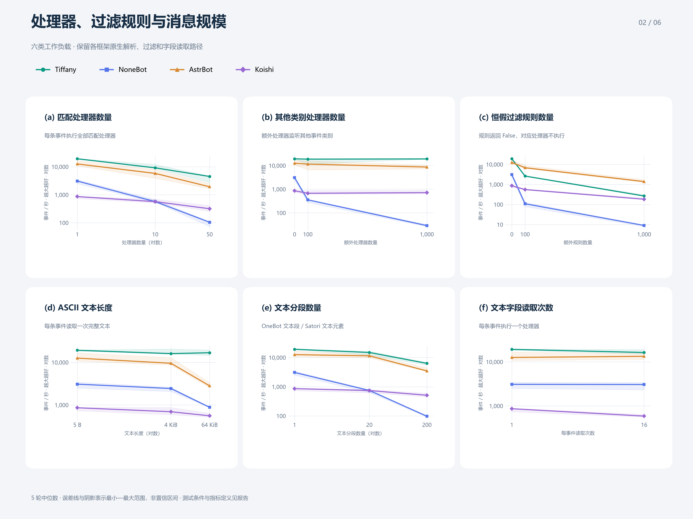
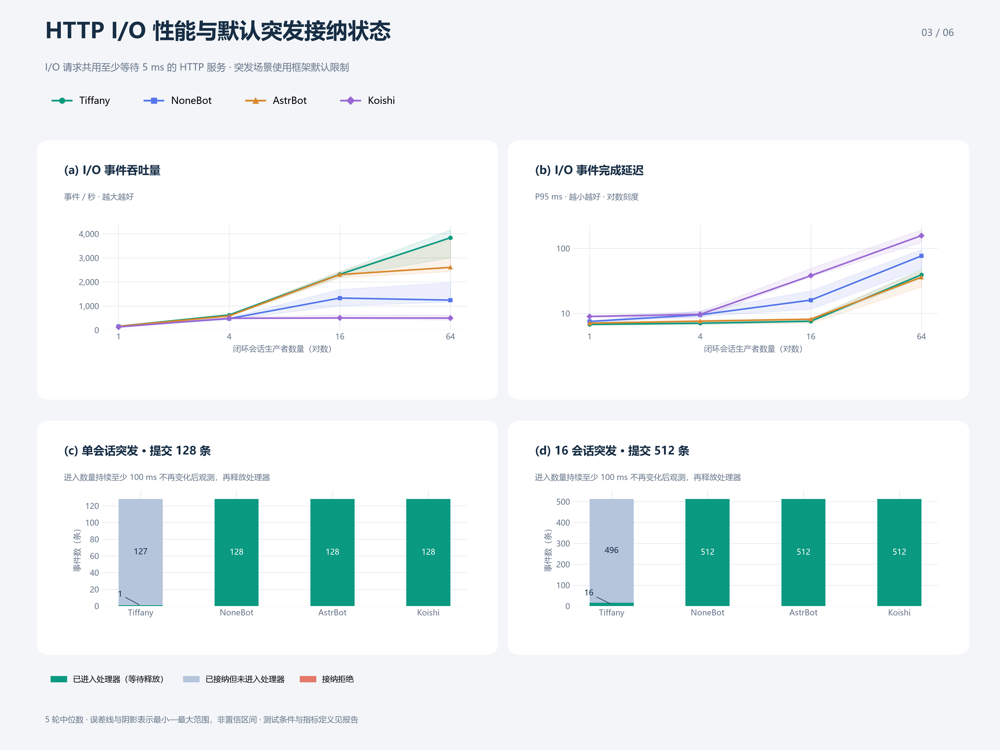
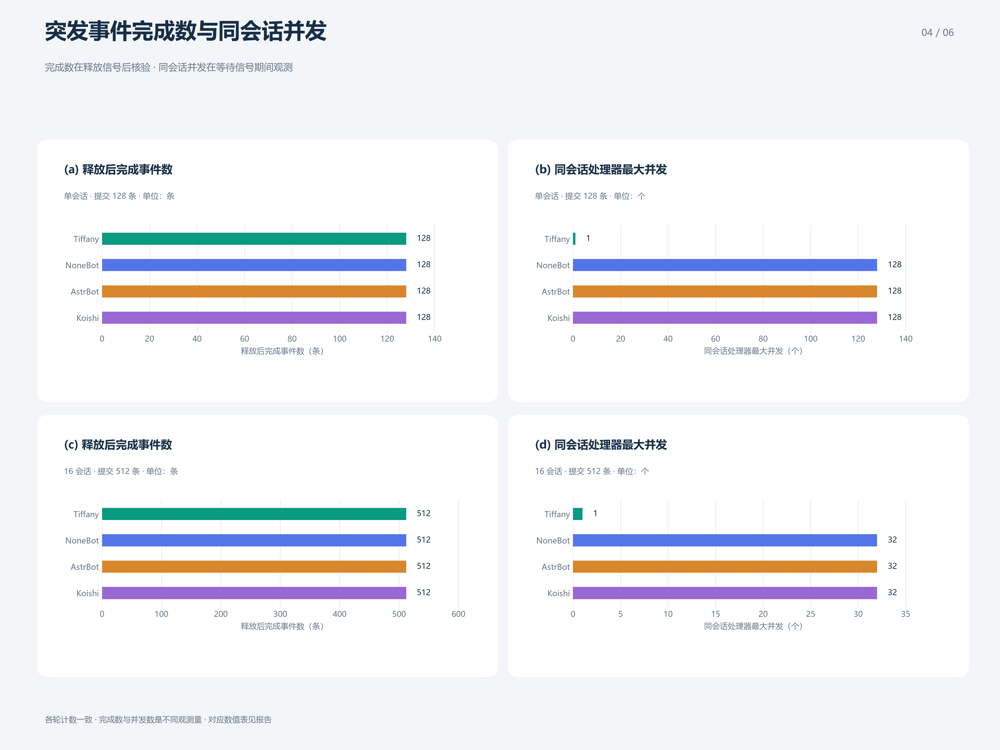
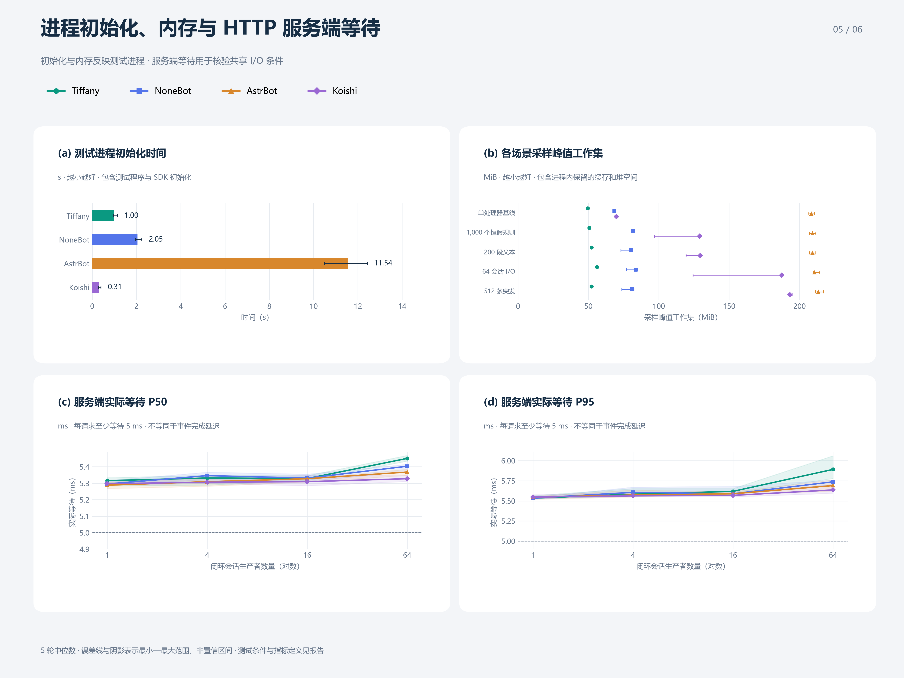
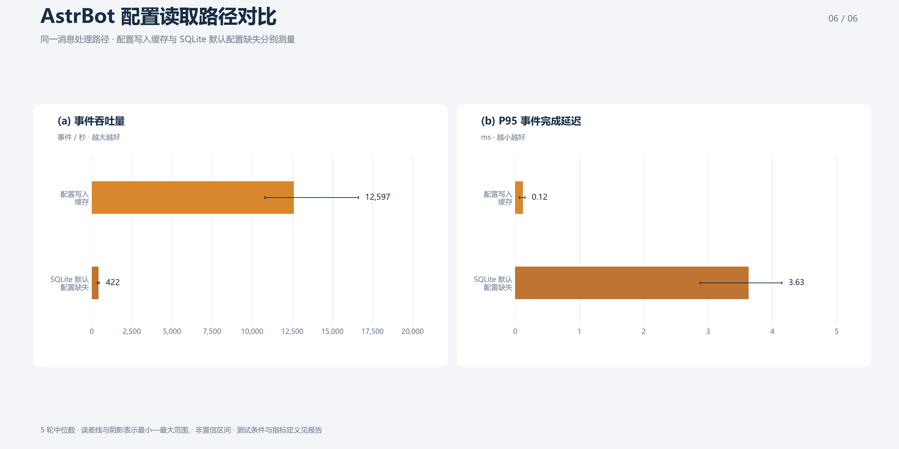

# 机器人框架离线消息处理基准

测试日期：2026-10-06。本报告对 Windows 环境中的 Tiffany、NoneBot、AstrBot 和 Koishi 消息处理路径进行描述性比较。

比较对象按项目用途选择，未依据测量结果筛选：

| 项目 | 代表的定位 | 本次原生入口 |
| --- | --- | --- |
| Tiffany | 原始事件、按需字段、Hook 业务、运行时管理调度与资源 | OneBot 字典 → Envelope → 完整 Bot.emit |
| [NoneBot](https://github.com/nonebot/nonebot2) | Python 异步插件框架 | OneBot Adapter.json_to_event → Bot.handle_event → Matcher |
| [AstrBot](https://github.com/AstrBotDevs/AstrBot) | 支持插件的 AI 机器人应用 | AiocqhttpAdapter.convert_message → 九阶段 PipelineScheduler |
| [Koishi](https://github.com/koishijs/koishi) | Node.js / TypeScript 插件框架 | Satori Session → 官方 MockBot.dispatch → 原生 middleware |

此前 [六框架报告](archive/FRAMEWORK_COMPARISON_EXPANDED.md)、[三框架报告](archive/FRAMEWORK_COMPARISON.md) 与原始结果完整保留。Entari、Graia Ariadne 不进入本轮主图，不能因此推断其优劣。

## 测量边界与环境

- Windows 11 26100，AMD Ryzen 9 7940H，16 个逻辑处理器；普通开发机，未锁频或隔离后台负载。
- 三个 Python 项目均使用 CPython 3.12.14、Windows 默认 ProactorEventLoop；Koishi 使用 Node.js 24.3.0 / libuv。版本与依赖通过锁文件固定。
- 每个框架 5 轮；每轮每个常规场景 1,000 条事件、预热 200 条。每轮框架使用独立进程，框架顺序轮换，单处理器基线先测，其余场景轮换。
- GC 开启，日志 ERROR；Tiffany 真实逐事件指标开启并核验。关闭 LLM、真实平台连接与发送 API，各框架仍保留原生解析、过滤、调度和生命周期。

输入文字和片段内容在计时外准备；计时内建立新的原生协议容器、解析并分发，直到全部匹配处理器完成。处理器核验文本并累计调用和字符数；恒假过滤规则（始终返回 False）核验实际调用次数。测试未包含 JSON 字节解码、WebSocket、平台限流、消息发送或模型推理。不同协议的对象构建和文本接口仍有差异，保留这些原生路径，未替换框架调度器。

无 I/O 场景使用一个串行生产者；I/O 场景每个会话有一个串行生产者，属于闭环测试。事件完成延迟从提交事件开始，至全部匹配处理器完成为止，包含该入口内的排队，不包含外部到达队列或平台回复。P50、P95 和 P99 分别为该延迟的第 50、95 和 99 百分位数。会话在本测试中对应私聊对象标识，不能据此推断真实平台端到端容量。

预热事件按序提交；正式 I/O 计时阶段才启用多个会话生产者。连接池扩容及首次建立额外 HTTP 连接的开销计入结果，因此 I/O 数字不等同于全部连接已预热后的持续吞吐。

I/O 共用独立 localhost HTTP 服务，每个请求以 perf_counter 截止时间保证至少等待 5 ms。服务使用 Python 3.14.4，在预启动的 64 个线程中以 time.sleep 的 Windows 高精度等待计时器等待，避免本机诊断中空闲 Proactor 定时器将 5 ms 放大至约 15 ms；完成等待后唤醒 HTTP 事件循环。[Python 官方文档](https://docs.python.org/3/library/time.html#time.sleep) 说明了 Windows 高精度等待计时器与操作系统调度造成的额外延迟。连接池上限均为 64。Tiffany 的全局与 Adapter 活动限制在 I/O 场景显式设为 1/4/16/64；突发场景恢复默认限制。框架自身事件循环和原生文本缓存策略保持原样。

AstrBot 主表使用官方偏好写入 API 缓存会话配置，保留全部九个 pipeline stage。SQLite 默认值缺失路径另测并单独列出。未使用的 LLM/会话资源设为调用即报错的占位对象，不会参与业务。Koishi 使用官方 MockBot，不启动真实平台 Adapter。

## 统计与图件约定

重复测量单位为框架进程，每个框架 n = 5；同次重复中的事件和场景不作为额外独立重复。每个常规场景在预热 200 条事件后计时 1,000 条事件。表格数值为跨轮中位数；P95/P99 先在每轮内计算，再取各轮结果的中位数，未合并全部事件重新计算分位数。

图 1 的吞吐卡片及条形图展示跨轮中位数，卡片另列吞吐范围；CPU 误差线表示最小–最大范围。图 2、图 3 上半部及图 5 下半部的点与阴影分别表示中位数和最小–最大范围，图 5 上半部、图 6 使用误差线表示同一范围。范围**不是置信区间、标准差或标准误**；连线仅连接已测条件，未进行曲线拟合或外推。图 3 下半部和图 4 为各轮一致的计数。本报告未进行显著性检验，数值差异仅描述本次样本。

进程工作集采用 Windows 上 psutil 报告的 RSS，包含已导入的 SDK；MiB = 2²⁰ B。预热后工作集在计时开始前读取；采样峰值覆盖场景设置、预热、计时和清理，采样间隔约 10 ms，可能遗漏短暂峰值。两者均不包含共享 HTTP 服务。CPU 时间为进程全部线程的累计 CPU 时间除以计时事件数，Windows 短样本计数具有量化误差，不能视为逐事件精确计时。

测试进程初始化时间由协调器从创建进程计时至观察到离线消息组件就绪信号，包含测试程序、SDK 初始化和输出观察开销。该指标不代表完整应用启动或平台登录耗时，与事件完成延迟分别标注。

每个比较维度同时提供图表及对应数值表：图表用于观察差异与变化，表格用于读取数值。图件使用圆角卡片布局，保留单位、面板标记和“越大／越小越好”的指标提示；接纳状态由独立图例说明。详细方法集中在报告中，图内保留简短说明。导出 300 dpi PNG 和矢量 SVG。

## 消息处理与资源


**图 1. 单处理器场景的事件处理与资源观测。** 顶部卡片同时展示事件吞吐量数值及统一量程条形图，所有条形从 0 开始，误差线为跨轮范围；测试进程初始化时间另在图 5(a) 和对应表格中比较。下部 (a) 为 P50/P95/P99 事件完成延迟，横轴为对数刻度；(b) 为预热后工作集及约 10 ms 采样峰值，竖线标记峰值，数字依次为预热后值与峰值；(c) 为单位事件 CPU 时间。数值为 5 轮中位数，CPU 误差线为最小–最大范围。

[300 dpi PNG](assets/performance/framework-representative-overview.png) · [矢量 SVG](assets/performance/framework-representative-overview.svg)

| 框架 | 吞吐量（events/s；中位数与范围） | P50（µs） | P95（µs） | P99（µs） | CPU 时间（µs/event） | 预热后工作集（MiB） | 采样峰值（MiB） |
| --- | ---: | ---: | ---: | ---: | ---: | ---: | ---: |
| Tiffany | 19,253 (18,441–19,557) | 48.9 | 59.6 | 131.0 | 46.9 | 49.5 | 49.5 |
| NoneBot 2.5.0 | 3,086 (2,500–3,419) | 301.6 | 464.0 | 639.4 | 328.1 | 68.5 | 68.5 |
| AstrBot 4.28.2 | 12,597 (10,795–16,630) | 71.2 | 121.7 | 193.2 | 93.8 | 208.4 | 208.4 |
| Koishi 4.18.11 | 862 (735–880) | 1,100.1 | 1,485.0 | 1,764.7 | 1,203.0 | 59.4 | 69.9 |

## 规则与消息规模



**图 2. 处理器、过滤规则与消息规模对事件吞吐量的影响。** (a) 匹配处理器数 1、10、50；(b) 额外其他类别处理器数 0、100、1,000；(c) 额外同类恒假过滤规则数 0、100、1,000；(d) ASCII 文本长度 5、4,096、65,536 B；(e) 文本分段数 1、20、200；(f) 每事件文本字段读取次数 1、16。所有纵轴为对数刻度；(a)、(d)、(e) 的横轴为对数刻度，其余横轴为数值线性刻度。点和阴影分别表示 5 轮中位数与最小–最大范围。未变化的条件沿用单处理器基线。

[300 dpi PNG](assets/performance/framework-representative-scaling.png) · [矢量 SVG](assets/performance/framework-representative-scaling.svg)

下表单位均为 **events/s**；多处理器场景每条事件执行所有匹配处理器，因此事件数不等于处理器调用数。

| 场景 | Tiffany | NoneBot | AstrBot | Koishi |
| --- | ---: | ---: | ---: | ---: |
| 1 个处理器 | 19,253 | 3,086 | 12,597 | 862 |
| 10 个处理器 | 9,143 | 570 | 5,783 | 568 |
| 50 个处理器 | 4,499 | 104 | 1,927 | 317 |
| 额外 100 个其他类别处理器 | 18,732 | 355 | 11,529 | 674 |
| 额外 1,000 个其他类别处理器 | 19,057 | 29 | 8,661 | 715 |
| 额外 100 个同类 False 规则 | 2,616 | 109 | 6,835 | 556 |
| 额外 1,000 个同类 False 规则 | 266 | 9 | 1,392 | 183 |

其他类别分别是 Tiffany/NoneBot 的 notice、AstrBot 的 OnLLMResponseEvent、Koishi 的 friend-added，不假定各框架分类成本相同。同类 False 规则使用 Hook.when、NoneBot Rule、AstrBot CustomFilter、Koishi Context.intersect，对应处理器不执行，规则体实际执行次数逐场景校验。规则返回 False 属于过滤不匹配，与突发场景中的容量接纳拒绝不同。Koishi 的中间件深度限制为 64，本轮最多使用 50 个匹配中间件。

| 场景 | Tiffany | NoneBot | AstrBot | Koishi |
| --- | ---: | ---: | ---: | ---: |
| 4 KiB 文本 | 16,051 | 2,439 | 9,539 | 696 |
| 64 KiB 文本 | 16,841 | 883 | 2,819 | 559 |
| 20 段纯文本 | 14,935 | 746 | 11,458 | 741 |
| 200 段纯文本 | 6,324 | 98 | 3,489 | 511 |
| 每个处理器读文本 16 次 | 16,341 | 3,059 | 13,380 | 586 |

所有长文本使用 ASCII；分段为 OneBot 的 text 段或 Satori 的文本元素数组，不包含图片、XML 转义等不同协议处理成本。读取接口分别是 ctx.resolve(TEXT)、event.get_plaintext()、event.message_str、session.content；重复读取保留各自原生缓存行为，每条事件仍只调用一次业务处理器。

## 闭环 HTTP I/O



**图 3. HTTP I/O 性能与默认突发接纳状态。** (a)、(b) 为闭环 HTTP I/O 吞吐量及 P95 事件完成延迟，点和阴影分别为 5 轮中位数与最小–最大范围。横轴为生产者数量 1、4、16、64，使用对数刻度；(b) 纵轴也为对数刻度。(c) 为单会话提交 128 条事件；(d) 为 16 会话提交 512 条，每会话 32 条。处理器等待测试控制器的释放信号，进入数量持续至少 100 ms 不再变化后记录状态，再释放并核验完成数。三类非零状态计数直接标注于堆叠柱，各轮完全一致；等待中的事件尚未完成，接纳计数不表示吞吐量。

[300 dpi PNG](assets/performance/framework-representative-load.png) · [矢量 SVG](assets/performance/framework-representative-load.svg)

事件吞吐量（events/s），各轮中位数：

| 闭环会话生产者数 | Tiffany | NoneBot | AstrBot | Koishi |
| --- | ---: | ---: | ---: | ---: |
| 1 | 156 | 147 | 152 | 124 |
| 4 | 627 | 474 | 585 | 487 |
| 16 | 2,317 | 1,329 | 2,305 | 501 |
| 64 | 3,837 | 1,243 | 2,604 | 496 |

P95 事件完成延迟（ms），各轮中位数：

| 闭环会话生产者数 | Tiffany | NoneBot | AstrBot | Koishi |
| --- | ---: | ---: | ---: | ---: |
| 1 | 6.76 | 7.50 | 7.05 | 8.96 |
| 4 | 7.06 | 9.50 | 7.58 | 9.65 |
| 16 | 7.56 | 15.99 | 8.13 | 37.98 |
| 64 | 39.28 | 76.62 | 36.01 | 157.23 |

服务端实际等待的图表和逐条件数值见图 5(c)、(d)。I/O 吞吐受到客户端、事件循环和服务端调度共同影响，不等于 CPU 调度器的最大吞吐。

## 默认配置下的突发接纳状态



**图 4. 突发释放后的完成数与等待期间的同会话并发。** (a)、(b) 为单会话提交 128 条；(c)、(d) 为 16 会话提交 512 条。(a)、(c) 为释放信号后完成的事件数；(b)、(d) 为等待信号期间同一会话已进入且未完成的处理器最大数量。5 轮计数一致，数字与下表的对应列相同；接纳状态另见图 3(c)、(d)。两种计数不表示吞吐量或优劣排序。

[300 dpi PNG](assets/performance/framework-representative-burst.png) · [矢量 SVG](assets/performance/framework-representative-burst.svg)

图 3(c)、(d) 展示所测原生消息入口的接纳状态，外围队列、平台限流或插件自定义保护不在测量范围内。下表提交、状态和完成量均为事件数，单位为条；最后一列为等待释放信号期间，同一会话已进入但未完成的处理器最大数量，单位为个。

| 场景 | 框架 | 提交 | 已进入处理器 | 已接纳未进入 | 接纳拒绝 | 释放后完成 | 同会话处理器最大并发 |
| --- | --- | ---: | ---: | ---: | ---: | ---: | ---: |
| 单会话 | Tiffany | 128 | 1 | 127 | 0 | 128 | 1 |
| 单会话 | NoneBot 2.5.0 | 128 | 128 | 0 | 0 | 128 | 128 |
| 单会话 | AstrBot 4.28.2 | 128 | 128 | 0 | 0 | 128 | 128 |
| 单会话 | Koishi 4.18.11 | 128 | 128 | 0 | 0 | 128 | 128 |
| 16 会话 | Tiffany | 512 | 16 | 496 | 0 | 512 | 1 |
| 16 会话 | NoneBot 2.5.0 | 512 | 512 | 0 | 0 | 512 | 32 |
| 16 会话 | AstrBot 4.28.2 | 512 | 512 | 0 | 0 | 512 | 32 |
| 16 会话 | Koishi 4.18.11 | 512 | 512 | 0 | 0 | 512 | 32 |

Tiffany 本轮总容量为 8192（含活动事件）、全局活动限制为 64、Adapter 活动限制为 64，同会话串行派发。共享估算占用预算为 64 MiB，总条数和字节预算各保留 1/8 供低占用会话使用。常规预算区不设独立的单会话积压硬上限；进入保留额度区后，接纳还要求该会话包含活动事件的条数不超过 32、估算排队占用不超过 min(256 KiB, 字节预算的 1/8)。本轮两种突发没有触及容量或保留额度边界，不能用其零拒绝数推断更大突发的接纳能力。未接纳事件没有重试，不计入处理成功数。已接纳但未进入处理器的数量由提交数减去已进入数及拒绝数得到，Tiffany 另外读取 Scheduler.active/queued 交叉核验。其他项目的该数量不指代特定原生队列。全部框架在释放信号后完成所有已接纳事件，没有重复处理。完成顺序记录在 JSON，但一次观测到 FIFO 不能证明框架具有同会话顺序保证。

## 进程初始化、内存与服务端等待



**图 5. 测试进程及共享 HTTP 服务的补充观测。** (a) 为测试进程初始化时间；(b) 为下表五种场景的采样峰值工作集，不是独立进程测得的净增量；(c)、(d) 分别为服务端实际等待 P50、P95，横轴为闭环生产者数量，使用对数刻度。虚线表示设定的 5 ms 等待下限。点或条形为 5 轮中位数，误差线及阴影为最小–最大范围。

[300 dpi PNG](assets/performance/framework-representative-resources.png) · [矢量 SVG](assets/performance/framework-representative-resources.svg)

图 5(a) 对应数据：

| 框架 | 测试进程初始化时间（s；中位数与范围） |
| --- | ---: |
| Tiffany | 1.00 (0.96–1.14) |
| NoneBot 2.5.0 | 2.05 (1.97–2.24) |
| AstrBot 4.28.2 | 11.54 (10.50–12.42) |
| Koishi 4.18.11 | 0.31 (0.29–0.40) |

图 5(b) 对应数据，单位 MiB，单元格为中位数（最小–最大）。峰值以约 10 ms 间隔采样，可能包含此前场景保留的缓存和堆空间：

| 场景 | Tiffany | NoneBot | AstrBot | Koishi |
| --- | ---: | ---: | ---: | ---: |
| 单处理器基线 | 49.5 (49.4–49.7) | 68.5 (67.9–68.7) | 208.4 (206.1–210.8) | 69.9 (68.9–70.2) |
| 1,000 个恒假规则 | 50.7 (50.6–50.9) | 81.9 (81.3–82.3) | 209.2 (207.0–211.6) | 129.0 (97.0–129.8) |
| 200 段文本 | 52.3 (52.3–52.6) | 80.5 (73.2–81.5) | 209.2 (207.1–211.6) | 129.4 (119.4–129.8) |
| 64 会话 I/O | 56.2 (55.4–56.5) | 83.5 (77.0–84.9) | 210.6 (209.8–214.4) | 187.3 (124.3–187.7) |
| 512 条突发 | 52.3 (51.2–52.6) | 81.0 (73.8–82.4) | 213.3 (211.5–217.1) | 193.2 (192.1–194.7) |

图 5(c) 对应数据：服务端实际等待 P50，单位 ms，单元格为中位数（最小–最大）：

| 闭环会话生产者数 | Tiffany | NoneBot | AstrBot | Koishi |
| --- | ---: | ---: | ---: | ---: |
| 1 | 5.32 (5.28–5.33) | 5.30 (5.29–5.32) | 5.29 (5.27–5.30) | 5.30 (5.29–5.32) |
| 4 | 5.33 (5.29–5.35) | 5.35 (5.32–5.37) | 5.31 (5.28–5.35) | 5.31 (5.30–5.33) |
| 16 | 5.33 (5.32–5.35) | 5.33 (5.31–5.35) | 5.33 (5.31–5.33) | 5.31 (5.28–5.35) |
| 64 | 5.45 (5.43–5.47) | 5.40 (5.37–5.41) | 5.37 (5.35–5.38) | 5.33 (5.31–5.35) |

图 5(d) 对应数据：服务端实际等待 P95，单位 ms，单元格为中位数（最小–最大）：

| 闭环会话生产者数 | Tiffany | NoneBot | AstrBot | Koishi |
| --- | ---: | ---: | ---: | ---: |
| 1 | 5.53 (5.53–5.57) | 5.53 (5.52–5.54) | 5.55 (5.52–5.56) | 5.55 (5.53–5.58) |
| 4 | 5.58 (5.56–5.65) | 5.61 (5.56–5.67) | 5.57 (5.55–5.64) | 5.56 (5.55–5.61) |
| 16 | 5.62 (5.59–5.65) | 5.59 (5.58–5.68) | 5.59 (5.58–5.61) | 5.57 (5.55–5.59) |
| 64 | 5.89 (5.78–6.06) | 5.74 (5.70–5.76) | 5.69 (5.62–5.76) | 5.64 (5.59–5.70) |

所有正式请求的最短实际等待为 5.015 ms，未出现提前返回；完整等待数据保留在原始 JSON。

## AstrBot 配置存储补充



**图 6. AstrBot 两种配置读取路径的事件处理结果。** (a) 为事件吞吐量；(b) 为 P95 事件完成延迟。两个条件均保留相同原生消息处理路径，条形为 5 轮中位数，误差线为最小–最大范围。

[300 dpi PNG](assets/performance/framework-representative-storage.png) · [矢量 SVG](assets/performance/framework-representative-storage.svg)

| 配置读取条件 | 吞吐量（events/s；中位数与范围） | P95 事件完成延迟（ms；中位数与范围） |
| --- | ---: | ---: |
| 配置写入缓存 | 12,597 (10,795–16,630) | 0.12 (0.07–0.15) |
| SQLite 默认配置缺失 | 422 (357–467) | 3.63 (2.88–4.15) |

两种条件分别测量，差异反映配置查询路径，不代表完整 AstrBot 产品的统一性能。

## 结果解释与适用范围

按本次样本中位数，单处理器场景的事件吞吐量最高为 Tiffany，1,000 个同类 False 规则场景最高为 AstrBot 4.28.2，64 个生产者的 HTTP I/O 场景最高为 Tiffany。这些排序没有显著性检验支持，且不同时覆盖延迟、资源占用和接纳契约，因此不合并为综合分数。

Tiffany 的核心思想是保留原始事件、按需解析字段、业务从 Hook 开始、由运行时管理调度与资源生命周期。其他类别路由、字段缓存和有界调度分别对应不同测试维度；这些设计不意味着每一种规则、文本或 I/O 工作负载都必然最快。默认队列限制和同会话串行带来明确的接纳边界，也意味着不能将未完成或被拒绝的事件计入吞吐。

本轮没有测量真实收发、数据库业务持久化、LLM、取消与 Scope 卸载、长时间内存增长或服务器环境。Koishi 的 Bot.dispatch 不返回每事件完成 Task，测试通过公开 middleware 完成事件观察结束，未伪造跨框架取消接口；取消/清理契约应结合各自 API 单独测试。这里只比较当前 Windows 环境中的离线消息路径，不给出整体产品优劣排名。

## 结果核验与复测

本轮完成 20 个框架进程重复、325 个常规场景观测和 40 个突发场景观测。正式计时核验 325,000 条事件、1,485,000 次处理器调用、22,000,000 次 False 规则调用、80,000 次 HTTP 请求；另外突发提交 12,800 条，完成 12,800 条，接纳拒绝 0 条。预热不计入这些数字。

- [原始 JSON](../benchmarks/results/representative/framework-comparison-representative.json)：全部采样、最小/最大值、计数核验、测试进程初始化时间、原生并发状态和来源指纹。
- [测量入口](../benchmarks/representative/run.py)、[工作负载](../benchmarks/representative/cases.py)、[Python 原生路径](../benchmarks/representative/engines.py)、[Python worker](../benchmarks/representative/worker.py)、[Koishi worker](../benchmarks/representative/koishi.cjs)。
- [结果校验](../benchmarks/representative/validate.py) 独立核对事件/字符/处理器/规则/HTTP/指标计数、分位值顺序、接纳状态和汇总值。
- [绘图](../benchmarks/representative/plot.py)、[报告生成](../benchmarks/representative/report.py) 只读结果，不重新采样。
- [Python 锁文件](../benchmarks/requirements-expanded.lock)、[Node 清单](../benchmarks/koishi/package.json) 与 [Node 锁文件](../benchmarks/koishi/package-lock.json) 固定依赖。Python 锁文件仍包含此前 Entari 等依赖，本轮不导入它们。

复用此前搭建的 `.build-cache/expanded-python-env` 和 `.build-cache/expanded-node-env`。环境重建方法见 [六框架报告](archive/FRAMEWORK_COMPARISON_EXPANDED.md#复测)。[共享 HTTP 服务](../benchmarks/representative/server.py) 由协调器自动启动与清理。在项目根目录执行：

```powershell
.\.build-cache\expanded-python-env\Scripts\python.exe -B -m benchmarks.representative.run --server-python .venv/Scripts/python.exe
$env:MPLCONFIGDIR = Join-Path (Get-Location) '.build-cache/matplotlib'
.\.venv\Scripts\python.exe -B -m benchmarks.representative.plot
.\.venv\Scripts\python.exe -B -m benchmarks.representative.report
```

`--events`、`--warmup`、`--repeats` 可调整；`--output` 将新结果保存到其他位置，图表和报告分别通过 `--input` 指定该文件。`--resume` 只在来源、依赖锁与方法均一致时跳过已完成的轮次，复测仍应保持解释器及已安装依赖与记录版本一致；结果校验会拒绝混用 Python/Node 版本或包版本的数据。协调进程需要 psutil，HTTP 服务解释器需要 aiohttp；本轮服务使用 Python 3.14.4。其他系统需通过 `--python`、`--node`、`--node-env` 指定可用路径，报告结论仍以本轮 Windows 数据为准。

Tiffany 来源 SHA-256：`6e4b4fb055c03d19d68ca35d0c58eb919588204ef447f9e638c6688f9042a768`。测量代码 SHA-256：`bdb36c36c16e854511b45664eccd23976becdf879f7d685690c300bc893a1ee6`。[源码边界](../benchmarks/representative/sources.py) 包含 core、adapters、clients、deployment、shared、fields.py 和 settings.py，采样前保存不可变快照，结束后再次核对工作区与测量代码；实际导入的生产模块均核验来自该快照，其路径与完整文件清单保留在 JSON。Python 依赖、Node 依赖和服务端环境也在 JSON 中记录。

[本轮源码与测量脚本快照](../benchmarks/results/representative/framework-comparison-representative-20261006-sources.zip) 包含生产源码、测量及展示脚本、依赖清单与逐文件 SHA-256，便于保留本轮测量对象。

[上一轮四框架结果](../benchmarks/results/archive/representative-20261004-e9db8644e5ff/docs/FRAMEWORK_COMPARISON_REPRESENTATIVE.md) 已保留原始数据、报告与六组图件；本轮只使用当前源码的新采样。
