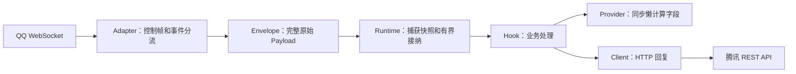

# QQ 官 Bot：接入设计与源码阅读

本文对应首版实现：一个账号、一条 WebSocket 连接，支持 QQ 群内 @机器人与 C2C 私聊的文本回复。默认 OneBot 配置保留。

## 1. 安装与运行

在项目根目录执行：

```powershell
python -m pip install -e ".[qqofficial]"
```

编辑 [官 Bot 配置示例](../examples/Tiffany.qqofficial.toml)，把 `app_id` 改为开发者后台的 AppID。将后台 AppSecret 放入当前终端的环境变量；不要把它写进 TOML：

```powershell
$env:TIFFANY_QQBOT_SECRET = "你的 AppSecret"
python -m examples.qqofficial
```

[示例入口](../examples/qqofficial.py) 通过公开 API 组装 Bot、现有 Hook 和适配器，读取自己的示例配置文件。服务器使用 `bash start.sh configure` 选择 QQ，可扫码或手动输入；配置保存在 `data/config/Tiffany.toml`，密钥单独保存。`python main.py` 同样读取 data 配置，但不提供环境准备和重启监督。参见[服务器部署文档](DEPLOYMENT.md)。

| 配置项 | 默认值 | 作用 |
| --- | --- | --- |
| `app_id` | 必填字符串 | 应用身份，不是机器人用户 ID |
| `app_secret_env` | `TIFFANY_QQBOT_SECRET` | 保存 AppSecret 的环境变量名；缺失时启动前报错 |
| `sandbox` | `false` | 选择生产或沙箱 API 地址；能否收到消息取决于账号和场景的后台配置 |
| `workers` | `4` | 适配器在 Scheduler 中的并发上限，范围 1～4 |
| `call_timeout` | `30.0` 秒 | HTTP 调用总预算，包括 Token 刷新、并发等待和认证重试 |

`start()` 获取 Token 和 `/gateway`，连接任务等待 Runtime 进入 RUNNING，再完成 HELLO → IDENTIFY → READY。日志出现 `QQ official connected` 才代表已完成网关鉴权；`bot.start()` 返回时可能仍在连接。

真机联调依次检查：账号及群/C2C 场景可用、网关鉴权成功、群 @ `ping` 回复 `pong`、私聊 `ping` 回复 `pong`、断线后能恢复。没有实际账号凭证时，本机模拟测试无法替代这一步。

腾讯旧事件文档仍保留 WebSocket 下线公告，而新 SDK 提供 WebSocket/Webhook 双接入。实际账号能否连接，以 `/gateway` 与鉴权结果为准。[官方事件文档源码](https://github.com/tencent-connect/bot-docs/blob/main/docs/develop/api-v2/dev-prepare/interface-framework/event-emit.md)、[腾讯新 SDK](https://github.com/tencent-connect/qqbot-nodejs/blob/main/README.zh-CN.md)

## 2. 一条消息如何经过 Tiffany



| 阅读顺序 | 文件 | 要理解的问题 |
| --- | --- | --- |
| 1 | [qqofficial_fields.py](../adapters/qqofficial_fields.py) | 如何从 `raw.d` 按需读取字段，保持原始事件不变？ |
| 2 | [QQOfficialClient.py](../clients/QQOfficialClient.py) | 如何共享认证、构造被动回复和限制 HTTP 调用？ |
| 3 | [QQOfficialWebSocketAdapter.py](../adapters/QQOfficialWebSocketAdapter.py) | 如何维护会话、区分接收序号与接纳序号、恢复连接？ |
| 4 | [配置工厂](../adapters/__init__.py)、[示例入口](../examples/qqofficial.py) | 如何把协议与业务组装到同一个 Runtime？ |

接入层只探测路由、会话和消息去重标识；正文、用户信息、附件和平台扩展字段不转换为完整消息对象。`ctx.raw` 是包含 `op/t/s/d/id` 的整个 Payload。附件不会被自动下载，Provider 不发网络请求。

`GROUP_AT_MESSAGE_CREATE`、`C2C_MESSAGE_CREATE` 映射为 `message`；群和好友生命周期通知映射为 `notice`；未知业务事件映射为 `event`。READY、RESUMED、心跳等连接控制帧不进入业务 Hook。

## 3. 字段与身份的边界

| 共享 Field | QQ 群消息 | C2C 私聊 |
| --- | --- | --- |
| `TEXT` | `d.content.strip()` | `d.content.strip()` |
| `MESSAGE_TYPE` | `group` | `private` |
| `USER_ID` | `d.author.member_openid` | `d.author.user_openid` |
| `GROUP_ID` | `d.group_openid` | `None` |
| `MESSAGE_ID` | `d.id` | `d.id` |
| `SELF_ID` | READY 的 `d.user.id` | READY 的 `d.user.id` |

共享 ID 类型是 `int | str | None`。OneBot 返回原有整数，官 Bot 返回原有字符串；例如 `"0000123"` 不会被转成 `123`。群成员 OpenID、C2C 用户 OpenID、READY 用户 ID 有不同的身份边界，不能据此跨场景识别同一人，也不能当作 QQ 号码。涉及身份存储时同时保存平台、账号和场景。

Field 必须复用 [fields.py](../fields.py) 中的同一实例。适配器 setup 在 `protocol.qqofficial` Scope 注册 Provider，teardown 撤销自己的句柄。相同平台第二个账号的注册会提前拒绝，不会破坏已注册账号的 Provider。

现有 [Ping Hook](../hooks/ping.py) 直接从 TEXT 匹配 `ping`，`ctx.reply("pong")` 自动使用事件携带的 Client。[命令 Provider](../hooks/command.py) 可用于其他命令功能。SELF_ID 与 USER_ID 的比较沿用已有 Hook；它不构成跨场景身份识别机制。

## 4. 连接状态、有界调度与恢复

- IDENTIFY 固定订阅群与 C2C 的 `1 << 25`，使用单连接分片 `[0, 1]`。
- 连接监督任务和当前连接的心跳任务都通过 `runtime.tasks.spawn(owner=adapter)` 注册。每个账号正常运行时只有这两个协议后台任务。
- QQ 心跳使用服务器指定周期、最新收到的 `s`，并检查 ACK；库层定时 Ping 关闭。接收循环不等待 Hook 完成，慢业务不会阻塞心跳和后续控制帧读取。
- WebSocket 接收缓冲为 16 帧，单条消息上限 1 MiB。Scheduler 默认容量 256（包含正在执行的事件），单会话积压 32，适配器默认并发 4。
- 会话键为 `AppID:group:group_openid` 或 `AppID:private:user_openid`。同会话按接收顺序处理，不同会话可以并行；框架不重新排列平台产生的事件。

两个序号用途不同：

| 状态 | 什么时候更新 | 用在哪里 |
| --- | --- | --- |
| 最新收到的序号 | 读取含 `s` 的帧 | QQ 心跳 |
| 已接纳的序号 | Runtime 接纳成功，或确认是已接纳消息的重复推送 | RESUME |

队列满时，适配器不记录去重、不推进恢复检查点；关闭当前连接并退避，再尝试 RESUME。普通断线保留会话；会话过期、序号无效、不可恢复的 INVALID_SESSION 清除会话并重新 IDENTIFY。恢复时腾讯可能在 RESUMED 前补发业务事件，接收循环允许这一过程。

重连退避在 1～60 秒间带抖动；限流至少等待 60 秒。短时间反复断开不会因 READY 而立即重置退避。鉴权失败刷新 Token 后最多重试一次；持续失败、明确权限错误及不合法的握手由关键任务失败机制结束 Runtime。日志记录阶段与错误码，不打印认证帧、原始消息或密钥。

消息去重键为场景、目标、消息 ID，缓存归属于当前账号的适配器。成功接纳后保存一小时，最多 4096 条，按插入顺序清理过期项和超量项，不为每条消息扫描整个缓存。

**恢复检查点表示已接纳，不表示业务已成功执行。** 当前没有持久化队列；进程重启、缓存淘汰、平台恢复窗口失效时不能保证补发或去重。框架保证内存和任务有界，保留原始数据供业务按需增加幂等处理。

## 5. HTTP Client 与被动回复

Client 使用独立的 HTTP 会话，与 WebSocket 生命周期分开。Token 请求为 `POST https://bots.qq.com/app/getAppAccessToken`，业务接口携带 `Authorization: QQBot <AccessToken>`。[官方鉴权文档](https://github.com/tencent-connect/bot-docs/blob/main/docs/develop/api-v2/dev-prepare/interface-framework/api-use.md)

- Token 缓存使用单调时钟，兼容字符串/数字 `expires_in`；正常有效期在到期前 60 秒按需刷新，异常短有效期使用其一半作为提前量。并发刷新通过锁合并，不增加常驻刷新任务。
- HTTP 并发默认 16；超时从公共调用入口开始，覆盖等待 Token、等待并发名额和发送。HTTP 响应上限 1 MiB；重定向不自动跟随。
- HTTP 401 或业务码 11243 刷新认证后最多重试一次。旧请求晚到的 401 不会清掉其他请求取得的新 Token。
- 限流、业务失败、网络失败及超时交给调用方；没有自动重发结果未知的消息。`QQOfficialAPIError` 提供 `status/code/message/trace_id`；超时使用 `TimeoutError`，网络失败使用 `QQOfficialTransportError`。
- drain 期间已接纳 Hook 仍可回复；事件排空后释放 Client。abort 取消在途调用；被中断的 Client drain 也会先结清等待者再关闭会话。

群回复走 `/v2/groups/{group_openid}/messages`，私聊走 `/v2/users/{openid}/messages`，发送 `content/msg_type=0/msg_id/msg_seq`。每个 Context 用一个私有 Field 保存回复序号，分配发生在 await 前，所以并发回复也获得不同序号。认证重试复用原序号和请求体。[官方发送文档](https://github.com/tencent-connect/bot-docs/blob/main/docs/develop/api-v2/server-inter/message/send-receive/send.md)

服务端限制被动回复窗口和频次，过期、超额及内容限制按 API 错误返回。首版没有主动推送封装；异步审核受理响应也不等于消息最终送达。

## 6. 进阶扩展从哪里开始

普通业务继续使用共享 Field 与 `ctx.reply()`。需要平台特殊字段时，自定义同步 Provider：

```python
from core import Field

ATTACHMENTS = Field[list]("qqofficial.attachments")

def attachments(ctx):
    return ctx.raw.get("d", {}).get("attachments", [])

bot.provide(ATTACHMENTS, attachments, platform="qq_official")
```

这里仅返回元数据。若要下载附件，在 Hook 或 Service 中 await 下载，并让该异步工作遵守相应的超时和容量边界。

平台专用 Hook 可以直接调用 `await ctx.client.request("GET", "/users/@me")`；HTTP 认证、容量和错误处理仍复用 Client。直接请求返回腾讯原始 JSON，204 返回 `None`，使用者自行遵守接口权限和参数规则。

新增平台事件先补路由探测与必要 Provider，新增发送类型在 Client 中封装；未来 Webhook 可以复用本 Client 和字段 Provider，仅更换事件接收端。需要多账号时再设计注册与身份边界，首版不增加多账号配置或通用插件管理层。

## 7. 自动验证

```powershell
python -B -m unittest discover -s tests/unit/qqofficial -t . -v
python -B -m unittest discover -s tests/integration/qqofficial -t . -v
python -B -m unittest discover -s tests -t . -q
```

单元测试隔离协议 I/O；集成测试使用 [本机模拟腾讯服务](../tests/support/qqofficial.py)，实际运行 HTTP、WebSocket、Runtime、Provider 和现有 Ping Hook。覆盖认证刷新、心跳、会话恢复、过载重试、去重、会话排序、业务并发、关闭及回滚。测试不连接腾讯，不使用真实凭证，也不自动下载附件。

仅安装基础依赖时，依赖 aiohttp 的测试会显式跳过；官 Bot 完整验证需安装 `qqofficial` 可选依赖。分类入口见 [测试目录导航](../tests/README.md)。
