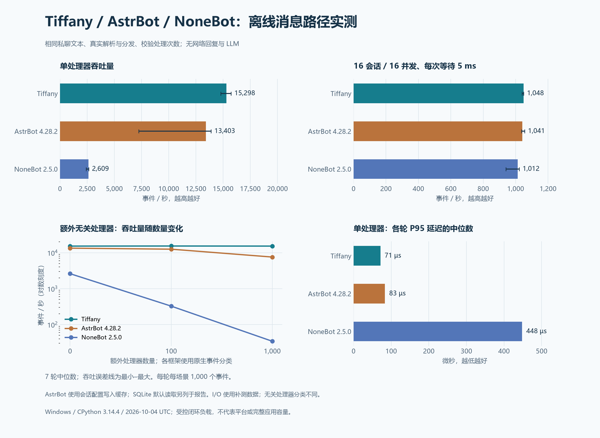

# Tiffany、AstrBot、NoneBot 离线性能对比（2026-10-04）

本报告保留 2026-10-04 该批源码的测量结果；后续改动和独立前后对照见 [2026-10-05 代码检查记录](CODE_AUDIT.md)。文中“当前”均指该批采样时的实现。

本次重新运行**当前 Tiffany 源码、AstrBot 4.28.2、NoneBot 2.5.0**，使用相同 OneBot V11 私聊文本和轻量业务。单处理器吞吐中位数分别为 **15,298、13,403、2,609 事件/秒**；当前 Tiffany 在本场景约为 AstrBot 缓存流水线的 **1.14 倍**、NoneBot 的 **5.86 倍**。模拟 I/O 在统一 16 并发后单独比较。

这是组件级离线测量，包含真实消息解析与原生分发，没有连接 QQ / NapCat、发送真实回复或调用 LLM。AstrBot 的完整应用、WebUI、插件发现和应用事件队列未启动；NoneBot 网络驱动未启动。数字描述本次路径，不能代表三个完整产品的线上容量或功能排名。



[SVG 图表](../assets/performance/framework-comparison-current.svg) · [本次主测数据](../../benchmarks/results/archive/comparison/framework-comparison-current.json) · [本次统一并发数据](../../benchmarks/results/archive/comparison/framework-concurrency-current.json)

## 环境与版本

| 项目 | 本次设置 |
| --- | --- |
| 采样时间 | 主测 2026-10-04 21:55–22:04；统一并发 2026-10-04 23:37–23:41，UTC+8 |
| 系统与 CPU | Windows 11，构建 26100；AMD Ryzen 9 7940H，16 个逻辑处理器 |
| Python | CPython 3.14.4，Anaconda 构建；三者共用同一隔离环境 |
| 事件循环 | Windows 默认 ProactorEventLoop，asyncio debug 关闭 |
| Tiffany | 当前本地源码，版本 0.1.0；以下源码指纹标识实际被测实现 |
| AstrBot | 官方发行包 4.28.2 |
| NoneBot | nonebot2 2.5.0；OneBot Adapter 2.4.6；`none + httpx` 驱动 |
| 采样 | 主测与补测均 7 轮，每场景每轮 1,000 个事件，预热 200 个 |
| 隔离与顺序 | 每框架每轮新子进程和临时工作目录；轮换框架及非基线场景顺序 |
| 日志与 GC | 框架日志设为 ERROR，GC 开启；显式 GC 在计时之外 |
| 观测条件 | Tiffany 保留逐事件本地指标；AstrBot 禁用上传遥测入口；NoneBot 不安装额外监控插件 |

全部依赖版本在主测 JSON 中；[依赖快照](../../benchmarks/requirements-comparison.lock) 为 Windows / CPython 3.14 的比较环境，不是服务器锁文件。本机 `D:\Projects\AstrBot` 未参与测试，使用隔离环境内的官方发行包。临时数据库、环境与历史归档均不使用 Tiffany 的 `data/`。

当前 Tiffany 被测源码的 SHA-256 为：

```text
4603f36949bdad4adeedcacde74eca44374237bc2946050f9f15ad5bb4ed90d0
```

指纹覆盖 `core/**/*.py`、`fields.py`、`adapters/onebot_fields.py` 与共用 `benchmarks/compare.py`。主测与补测指纹一致，并与报告生成时的工作区源码核验一致；补测另存脚本 SHA-256。文档不在被测源码指纹内。

## 单处理器：吞吐、延迟与内存

吞吐为各轮中位数；P95/P99 先每轮计算，再取中位数。AstrBot 主表使用配置命中进程写入缓存的条件，SQLite 条件另列。

| 框架 / 条件 | 事件/秒 | 各轮最小–最大 | P95（µs） | P99（µs） | 预热后组件 RSS（MiB） |
| --- | ---: | ---: | ---: | ---: | ---: |
| Tiffany | 15,298 | 14,785–15,731 | 71.3 | 109.6 | 35.8 |
| AstrBot，配置命中写入缓存 | 13,403 | 7,238–13,891 | 83.4 | 150.0 | 240.1 |
| NoneBot | 2,609 | 2,409–2,635 | 448.0 | 606.0 | 62.0 |

当前 Tiffany 在此业务的吞吐比 AstrBot 缓存流水线高 **14.1%**。RSS 包含解释器和被测组件，是初始化与预热后的工作集，不是完整应用的空闲内存、峰值或部署内存要求。

AstrBot 第 7 轮单处理器缓存路径降至约 7,238 事件/秒，SQLite 路径约 190 事件/秒，均保留在范围和原始数据中。没有剔除慢轮，也没有对此轮单独进行 profiler 诊断；不能把原因归结为某项框架机制。图中误差线为最小–最大，不是置信区间。

### AstrBot 的配置读取条件

主测通过真实 `SharedPreferences.put_async()` 写入测试会话的 `session_plugin_config`、`session_service_config`，值为 `{}`，并等待持久化。这是该版本本进程写入形成的覆盖缓存，不是修改框架或仅靠预热得到的读取缓存。

另一组通过真实 API 删除两个配置项，使流水线查询真实 SQLite；同样预热 200 个事件，不只测首次冷查询。

| AstrBot 单处理器条件 | 事件/秒 | 各轮最小–最大 | P95（µs） |
| --- | ---: | ---: | ---: |
| 本进程写入配置，命中覆盖缓存 | 13,403 | 7,238–13,891 | 83.4 |
| 缺省配置项，读取真实 SQLite | 483 | 190–494 | 2415.8 |

两种数字适用于不同配置读取路径。图表中的 AstrBot 非 SQLite 数据都使用配置写入缓存；不能把其中一个数推广成所有 AstrBot 插件或会话的性能。

## 多处理器与无关处理器

| 场景 | Tiffany（事件/秒） | AstrBot，写入缓存（事件/秒） | NoneBot（事件/秒） |
| --- | ---: | ---: | ---: |
| 1 个匹配处理器 | 15,298 | 13,403 | 2,609 |
| 10 个匹配处理器 | 9,390 | 5,914 | 567 |
| 1 个匹配 + 100 个无关处理器 | 15,386 | 12,558 | 326 |
| 1 个匹配 + 1,000 个无关处理器 | 15,300 | 7,584 | 34.3 |

十个匹配处理器都执行同一个文本读取业务；Tiffany/AstrBot 依次执行，NoneBot 的同优先级 Matcher 可并行检查和执行，使用 `block=False` 防止提前阻断。这是无 I/O 业务，不能据此推断异步插件的实际并发优势。

无关类别使用原生分类：Tiffany/NoneBot 为 `notice`，AstrBot 为 `OnLLMResponseEvent`，输入均为私聊消息。分类语义不同，数字反映各自注册表和检查路径，不等于安装同样数量的真实插件。Tiffany 注册表不变、预热后命中路由缓存；AstrBot 扫描并过滤处理器类别，NoneBot 执行 Matcher 检查。这些路径可以在已安装源码和测量脚本中复核，本次未用 profiler 分解其贡献。

## 模拟 I/O：统一 16 并发

三者使用 16 个会话生产者，每个等待前一事件完成后再提交下一事件，最多 16 个在途事件；业务执行 `asyncio.sleep(0.005)`。Tiffany 通过公开 `configure_adapter("benchmark", active_limit=16)` 设置，保留全局 16 上限和同会话串行。AstrBot 保持上述写入缓存条件。

| 框架 | 中位事件/秒 | 各轮最小–最大 | P95（ms） | P99（ms） |
| --- | ---: | ---: | ---: | ---: |
| Tiffany | 1,048 | 1,040–1,050 | 15.96 | 16.33 |
| AstrBot，配置命中写入缓存 | 1,041 | 1,036–1,056 | 16.00 | 17.50 |
| NoneBot | 1,012 | 939–1,022 | 16.88 | 32.24 |

三者中位吞吐的最大差距约 **3.6%**；这一组主要受实际等待和事件循环调度影响。Windows 上请求等待 5 ms，事件 P50 实际约 15 ms，不能用名义 5 ms 换算平台容量。它是闭环往返延迟，没有测量固定到达率下的积压或丢弃率。

主测另保留 Tiffany 默认 Adapter 4 并发的结果：**262.9 事件/秒、P95 62.07 ms**。该配置与另两者的 16 并发不同，不用于图表中的公平 I/O 对比；补测只调整公开并发参数。

## 实际路径与验证边界

| 框架 | 计时包含的处理路径 |
| --- | --- |
| Tiffany | 原始字典 → 分类与 Envelope（含事件 ID）→ 完整 Bot.emit → Runtime/Scheduler → Hook → ctx.resolve(TEXT) → 完成通知，含指标和任务归属维护 |
| NoneBot | 原始字典 → OneBot json_to_event → Bot.handle_event → 原生 Matcher 检查与依赖注入 → get_plaintext → 处理器完成 |
| AstrBot | 原始字典 → aiocqhttp Event → convert_message → AiocqhttpMessageEvent → 9 个原生 Pipeline 阶段 → 插件处理器 → message_str |

AstrBot 保留真实 SQLite、SharedPreferences 和九阶段流水线；关闭 LLM、STT、TTS、内容安全、限流、白名单和分段回复，私聊不要求前缀。未使用的会话设施采用会在意外访问时报错的最小占位对象；不测试插件发现或完整应用组合。`ASTRBOT_DISABLE_METRICS=1` 禁用上传入口及其附带统计写入，避免离线测量产生外网遥测；Tiffany 本地指标继续更新，各框架的观测开销并不相同。

每条消息是相同文本 `hello`，使用同一个业务消费者。每轮校验调用数为 `事件数 × 匹配处理器数`、字符数为 `调用数 × 5`、无关处理器调用数为 0。主测共 112,000 个、统一并发补测 21,000 个计时事件，全部通过校验；预热另计。

Tiffany 保留原始事件、按需解析字段、业务从 Hook 开始、由运行时管理调度和资源生命周期。本次较低分发成本与该实现一致，未单独拆分每个设计的贡献。NoneBot 的完整事件模型与依赖注入、AstrBot 的插件和 AI 应用能力都超出此轻量业务，性能数字不评估生态、功能完整度或可靠性。

本轮结论以 Windows 实测为准。Linux 目标服务器、真实 WebSocket → ping → 平台回复、固定到达率压测、长时运行和内存峰值应另测。采样未固定 CPU 频率或隔离所有后台负载；本报告只使用本次当前版本，不将其他批次数字拼成排名。

## 复测与历史记录

测量脚本：[compare.py](../../benchmarks/compare.py)、[compare_concurrency.py](../../benchmarks/compare_concurrency.py)；绘图：[plot_comparison.py](../../benchmarks/plot_comparison.py)。比较环境是可选开发工具，不进入服务器依赖集合。

```powershell
python -m venv .build-cache/framework-comparison-env
$benchPython = ".\.build-cache\framework-comparison-env\Scripts\python.exe"
& $benchPython -m pip install -r benchmarks/requirements-comparison.lock
& $benchPython -B -m benchmarks.compare --events 1000 --warmup 200 --repeats 7 --output benchmarks/results/archive/comparison/framework-comparison-current.json
& $benchPython -B -m benchmarks.compare_concurrency --events 1000 --warmup 200 --repeats 7 --output benchmarks/results/archive/comparison/framework-concurrency-current.json

# 绘图在采样结束后运行；使用安装了 Matplotlib 的环境
python -B -m benchmarks.plot_comparison --input benchmarks/results/archive/comparison/framework-comparison-current.json --concurrency-input benchmarks/results/archive/comparison/framework-concurrency-current.json --output docs/assets/performance/framework-comparison-current
```

Linux 使用独立 Python 3.12+ 环境，按 [requirements-comparison.in](../../benchmarks/requirements-comparison.in) 安装并记录自己的依赖，再重新测量。上述比较环境的版本要求不改变 Tiffany 的 Python 3.11 支持。

上述命令覆盖带 `-current` 的结果和图表。此前三框架采样保留在 [历史报告](FRAMEWORK_COMPARISON_INITIAL.md)、原有不带 `-current` 的 JSON 与图表，以及本地 `.build-cache/framework-comparison-history/pre-current-rerun/` 归档中。历史数据不参与本次计算。
