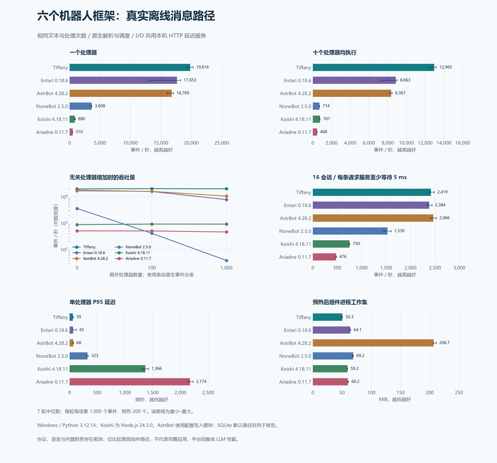

# Tiffany / AstrBot / NoneBot / Koishi / Ariadne / Entari 实测

本轮把 Koishi、Graia Ariadne 和 Entari 纳入比较，并重新测试当前 Tiffany、AstrBot、NoneBot。**六者的数据全部来自本轮实际运行**，采用相同文本和处理次数，经过各自真实消息解析与分发路径。

当前样本中，Tiffany 单处理器吞吐约 **19,816 事件/秒**，Entari 与 AstrBot 也在同一量级。共享 HTTP I/O 场景下，这三者约为 **2,400 事件/秒**。结果用于理解组件路径成本；不同语言、协议和内置职责的差异也包含在结果中。



[原始 JSON](../../benchmarks/results/archive/comparison/framework-comparison-expanded.json) · [SVG 图表](../assets/performance/framework-comparison-expanded.svg) · [测量脚本](../../benchmarks/compare_expanded.py) · [原生接入代码](../../benchmarks/expanded_engines.py) · [Koishi worker](../../benchmarks/koishi_worker.cjs)

## 参与框架与候选

| 项目 | 定位与本轮安排 |
| --- | --- |
| [Tiffany](../../README.md) | 原始事件、按需字段、Hook 业务与运行时资源管理；参与测试 |
| [AstrBot](https://github.com/AstrBotDevs/AstrBot) | 机器人应用及插件、LLM 流水线；测试关闭 LLM 后的真实消息流水线 |
| [NoneBot](https://github.com/nonebot/nonebot2) | Python 异步机器人框架；测试 OneBot v11 的解析、Matcher 与依赖注入 |
| [Koishi](https://github.com/koishijs/koishi) | TypeScript / Node.js 跨平台框架；使用官方 MockBot 进入原生 Satori Session 和核心中间件 |
| [Graia Ariadne](https://github.com/GraiaProject/Ariadne) | 基于 Mirai API HTTP 的 Python QQ 框架；保留 Ariadne 接收钩子、缓存与 Broadcast |
| [Entari](https://github.com/ArcletProject/Entari) | 基于 Satori 的 Python IM 框架；保留事件模型、消息转换与 Letoderea 依赖注入 |
| [OlivOS](https://github.com/OlivOS-Team/OlivOS) | 多进程交互栈；本轮未测，后续应包含原生队列和进程间通信 |
| [Miao-Yunzai / 云崽](https://github.com/yoimiya-kokomi/Miao-Yunzai) | Node.js 机器人应用与插件生态，部署含 Redis 等组件；本轮未测，适合单独做应用级比较 |
| [Mirai](https://github.com/mamoe/mirai) | JVM 上的 QQ 协议支持库及机器人生态；本轮未测，协议与 JVM 成本需另行定义 |

Entari 是补充的同类参考项目。本表不按社区热度排序，也没有给未运行的项目推算性能。

## 环境与方法

| 项目 | 本轮设置 |
| --- | --- |
| 时间 | 2026-10-05 00:59–01:09，UTC+8；JSON 保存 UTC 时间 |
| 系统 / CPU | Windows 11 26100，AMD Ryzen 9 7940H，16 个逻辑处理器 |
| Python | 五个 Python 框架均为 CPython 3.12.14；Ariadne 的 Pydantic v1 依赖独立安装 |
| Node.js | Koishi 使用 Node.js 24.3.0、Koishi core 4.18.11、Satori core 4.6.0、官方 mock 插件 2.6.6 |
| 采样 | 7 轮；每轮每场景 1,000 个事件，预热 200 个事件 |
| 进程 | 每个框架每轮启动新进程；框架顺序轮换；单处理器基线先测，其余场景轮换 |
| CPU 业务 | 每条消息的每个匹配处理器读取文本 `hello`，校验内容并计数 |
| I/O 业务 | 每条消息向同一个本机 HTTP 服务发一次请求，校验状态、响应文本与实际服务等待时间 |
| 并发 | CPU 单会话串行；I/O 为 16 会话、最多 16 条在途事件；Tiffany 此场景显式配置 Adapter 并发 16 |
| 计时 | 新建协议字典 → 真实解析 → 原生分发 → 所有匹配处理器完成 |
| 运行状态 | GC 开启、asyncio debug 关闭、日志 ERROR；Tiffany 真实逐事件指标开启，Trace 关闭 |
| 工作集 | 单处理器预热后进程 RSS；包含解释器与已加载组件，不是完整机器人空闲内存或峰值 |

安装版本分别锁定在 [Python 主环境](../../benchmarks/requirements-expanded.lock)、[Ariadne 环境](../../benchmarks/requirements-graia.lock) 和 [Node 环境](../../benchmarks/koishi/package-lock.json)。服务器依赖和 `data/envs/` 没有因本次测试而改动。

所有表格取 **7 轮结果的中位数**。P95/P99 是各轮分位数的中位数，最小–最大范围与图表误差线均不是置信区间。普通开发机器没有锁定 CPU 频率或隔离全部后台负载；保留了 Entari 第七轮单处理器较慢的样本，没有择优删除。

本轮共核验 **217 个场景样本、217,000 个计时区间事件、595,000 次匹配处理器调用和 42,000 次 HTTP 请求**。字符数与调用数一致，所有无关处理器调用均为零；Tiffany 的指标还核验了包含预热的 42,000 条事件。

### 原生路径与保留的职责

| 框架 | 计时中的路径 |
| --- | --- |
| Tiffany | OneBot 字典 → 事件类型检测 / Envelope → `Bot.emit()` → Runtime / Scheduler 独立事件 Task → Context / TEXT Provider → Hook；逐事件指标照常更新 |
| AstrBot | aiocqhttp Event → `convert_message()` → AstrBot 消息事件 → 已初始化的 9 阶段 PipelineScheduler → 插件过滤与处理器；保留真实 SQLite / SharedPreferences |
| NoneBot | `Adapter.json_to_event()` → `Bot.handle_event()` → 原生 Matcher、检查和依赖注入；匹配处理器同优先级且不阻断后续处理器 |
| Koishi | 新建 Satori 消息对象 / 原生 `h.parse()` → MockBot 的 `session()` / `dispatch()` → 核心中间件、命令解析与上下文机制；用公开 `middleware` 完成事件确认整条流水线结束 |
| Ariadne | Mirai 字典 → `build_event()` → Ariadne `_event_hook()` 的上下文及消息/好友缓存 → Broadcast 原生调度与依赖注入；观察 `postEvent()` 返回的 Task 并等待完成 |
| Entari | Satori `Event.parse()` → Entari `handle_event()` / `event_parse()` → Letoderea 发布、Session Provider 与原生订阅者 |

Ariadne 的完成观察只转发并保存原生 Task，未替换 Broadcast。Koishi 使用[官方测试插件](https://koishi.chat/zh-CN/plugins/develop/mock)，提供离线平台对象；消息处理仍经过 Koishi 核心。没有用只调用业务函数的自制分发器代替框架。

AstrBot 主表采用会话配置已写入其原生进程缓存的条件；空配置触发 SQLite 默认读取的条件单独列出。LLM、语音与内容安全等外部能力关闭，未用到的会话/LLM 管理对象在测试中明确拒绝访问。此路径保留 9 阶段，但没有启动整个 AstrBot 应用。

AstrBot 通过 `ASTRBOT_DISABLE_METRICS=1` 关闭指标上报；其他框架没有人工添加与 Tiffany 等量的指标。Tiffany 的逐事件内部指标照常启用。各框架的内置职责和观测成本存在差异，本轮也没有为 Koishi 安装数据库插件。

Ariadne 的 creart 探测两个 Commander 入口点时产生启动警告，发生在计时区间之外。本轮接收业务使用标准 MessageChain 依赖注入，所有处理次数校验通过。平台连接和后台缓存过期服务没有启动，原生缓存写入包含在计时中。

## 单处理器：吞吐、尾延迟与工作集

| 框架 | 中位吞吐（事件/秒） | 各轮最小–最大 | P95（µs） | P99（µs） | 预热 RSS（MiB） |
| --- | ---: | ---: | ---: | ---: | ---: |
| Tiffany | 19,816 | 19,269–20,304 | 59.0 | 126.9 | 50.3 |
| Entari 0.18.6 | 17,653 | 12,959–18,259 | 64.8 | 105.4 | 64.1 |
| AstrBot 4.28.2 | 16,789 | 16,025–17,080 | 67.5 | 105.4 | 206.7 |
| NoneBot 2.5.0 | 3,608 | 3,521–3,660 | 323.2 | 429.3 | 69.2 |
| Koishi 4.18.11 | 880 | 851–915 | 1,366.0 | 1,555.9 | 59.2 |
| Graia Ariadne 0.11.7 | 510 | 505–517 | 2,173.8 | 2,383.4 | 60.2 |

Tiffany 在此业务中吞吐最高、P95 最低；与 Entari、AstrBot 的吞吐差距约为 **12.3% / 18.0%**。Tiffany 的 P99 为 126.9 µs，高于 Entari 和 AstrBot 的约 105.4 µs，不能将吞吐领先等同于所有延迟指标领先。

### Koishi 与 Ariadne 的热点核查

在正式数据采集结束后，另用 Node CPU profiler 与 Python cProfile 核查单处理器路径；诊断开销和诊断吞吐没有混入正式数据。

- Koishi 的热点集中在 Cordis 的上下文代理、属性访问与上下文派生。被测版本的代理访问路径会构造 `Error` 用于注入诊断；这些原生机制没有被删除。该结果同时包含 V8 运行时和 Koishi 内置处理流程的成本。
- Ariadne 的原生 `Source` 构造使用 `internal_cls` 检查调用者，该检查调用 `inspect.stack()`。500 个事件的诊断中，这条路径大量执行 `findsource` / `linecache.checkcache` / Windows `stat`；仅 `build_event()` 的累计时间就约 1.105 秒（含 profiler 开销）。因此，510 事件/秒不能解读成 Broadcast 调度器单独的速度，也不能套用到 Linux。
- Ariadne 的 Pydantic 1.10.26 已确认启用编译扩展，较慢结果并非误用了纯 Python 构建。

[诊断摘要](../../benchmarks/results/archive/comparison/framework-comparison-expanded-diagnostics.json) 保存核查信息，正式性能结论仍使用上面的 7 轮无 profiler 样本。

## 多处理器与无关处理器

单位均为事件/秒，一个事件在十处理器场景实际执行十次业务。

| 框架 | 单处理器 | 十个匹配处理器 | 额外 100 个无关处理器 | 额外 1,000 个无关处理器 | HTTP I/O、16 会话 |
| --- | ---: | ---: | ---: | ---: | ---: |
| Tiffany | 19,816 | 12,965 | 20,333 | 20,071 | 2,419 |
| Entari 0.18.6 | 17,653 | 8,863 | 15,897 | 7,800 | 2,384 |
| AstrBot 4.28.2 | 16,789 | 8,367 | 16,025 | 10,634 | 2,466 |
| NoneBot 2.5.0 | 3,608 | 714 | 413 | 39 | 1,530 |
| Koishi 4.18.11 | 880 | 767 | 920 | 918 | 750 |
| Graia Ariadne 0.11.7 | 510 | 468 | 507 | 463 | 476 |

无关处理器使用各框架的原生分类：Tiffany / NoneBot 为 notice，AstrBot 为 LLM-response，Koishi / Entari 为 friend-added，Ariadne 为 AccountLaunch。这些事件类别能验证原生分类和筛选的成本，不能代表全部订阅同一种消息但业务谓词不同的插件集合。

Tiffany 的预热后路由缓存使这批无关 Hook 对吞吐影响较小；Koishi 的分类事件监听也相对稳定。Entari 与 AstrBot 有一定下降，NoneBot 在此同优先级 Matcher 场景下降较明显。十处理器场景保留各框架自己的串行/并行处理策略，本次没有在十个处理器中加入 I/O，结论限于同步完成的轻量异步业务。

## 同一 HTTP 服务的 I/O 比较

服务独立运行在 CPython 3.14.4 / aiohttp 3.14.3。Windows 下仅服务进程请求 1 ms 定时周期，并用高精度 `perf_counter` 截止时间保证每个请求**至少等待 5 ms**。服务进程退出后恢复计时请求。框架 worker 使用其默认事件循环，Python / Node 客户端都保留连接池且限制 16 条连接。

这样让外部等待由同一进程产生；客户端 HTTP 实现、请求发起时刻及调度仍会造成差异，所以同时公布服务端实际等待和整条事件延迟。不能把“至少 5 ms”当成每次严格等于 5 ms，也不能把名义上的 3,200 事件/秒当作可直接达到的吞吐。

| 框架 | 中位吞吐（事件/秒） | 各轮最小–最大 | 事件 P95（ms） | 事件 P99（ms） | 服务等待 P50 / P95（ms） |
| --- | ---: | ---: | ---: | ---: | ---: |
| Tiffany | 2,419 | 2,384–2,488 | 7.45 | 12.17 | 5.19 / 6.03 |
| Entari 0.18.6 | 2,384 | 2,345–2,443 | 7.69 | 13.00 | 5.20 / 6.08 |
| AstrBot 4.28.2 | 2,466 | 2,417–2,530 | 7.54 | 11.79 | 5.14 / 6.11 |
| NoneBot 2.5.0 | 1,530 | 1,458–1,607 | 12.48 | 15.97 | 5.48 / 6.45 |
| Koishi 4.18.11 | 750 | 740–760 | 22.56 | 26.52 | 5.25 / 6.09 |
| Graia Ariadne 0.11.7 | 476 | 471–484 | 35.29 | 41.29 | 5.73 / 6.68 |

AstrBot、Tiffany、Entari 的范围相互重叠，主表量级接近；外部等待主导时，单处理器 CPU 成本的差距缩小。此场景使用一个生产者对应一个会话的闭环请求，不是在持续到达负载下测排队延迟。

## AstrBot 的 SQLite 默认读取条件

同版本、同文本、同处理器，只有会话配置命中缓存的条件不同：

| 条件 | 中位吞吐（事件/秒） | 各轮最小–最大 | P95（µs） |
| --- | ---: | ---: | ---: |
| 主表：配置写入原生缓存 | 16,789 | 16,025–17,080 | 67.5 |
| 空配置：SQLite 默认读取 | 565 | 530–568 | 2,080.7 |

保留此条件可以看出持久化读取对实际消息路径的影响；不能用 SQLite 条件代表缓存命中场景，也不能把两组数字混合成一个框架成绩。

## 测量边界与 Tiffany 的设计

本轮观察支持 Tiffany 在这个轻量业务下的低成本路径：保留原始字典、按需读取 TEXT、复用本事件字段缓存、缓存分类路由，同时保留独立事件 Task 和逐事件指标。

**核心思想仍是原始事件、按需字段、Hook 业务和运行时资源生命周期。** 这些约束需要通过正确性测试保持，不能为获得更高数字绕过事件任务、去掉指标、跳过取消处理或仅测 Dispatcher。

选型还应结合生态、平台适配、开发体验与完整业务。该实验未测平台 WebSocket 收包、JSON 字符串解码、真实 QQ 回复、LLM、重载扩展、持续过载、运行稳定性或应用启动峰值。Koishi 的语言和协议模型不同；Ariadne / Entari 的协议也不同于 OneBot。I/O 的本机 HTTP 请求包含在计时中，平台网络没有参与。

这批使用当前源码和 Python 3.12 重新采样，和[此前三框架报告](FRAMEWORK_COMPARISON.md)、[初次报告](FRAMEWORK_COMPARISON_INITIAL.md) 分别保存。本文没有对 Tiffany 历史版本做前后优化比较，也没有把不同批次的成绩拼接到当前表格。

## 复测

在 Windows 项目目录准备独立环境；`py` 不可用时可以换成对应版本 Python 的绝对路径：

```powershell
py -3.12 -m venv .build-cache/expanded-python-env
.\.build-cache\expanded-python-env\Scripts\python.exe -m pip install -r benchmarks/requirements-expanded.lock
py -3.12 -m venv .build-cache/graia-env
.\.build-cache\graia-env\Scripts\python.exe -m pip install -r benchmarks/requirements-graia.lock
py -3.14 -m venv .build-cache/expanded-server-env
.\.build-cache\expanded-server-env\Scripts\python.exe -m pip install aiohttp==3.14.3

New-Item -ItemType Directory -Path .build-cache/expanded-node-env -Force
Copy-Item benchmarks/koishi/package*.json .build-cache/expanded-node-env/
npm --prefix .build-cache/expanded-node-env ci --no-audit --no-fund

.\.build-cache\expanded-server-env\Scripts\python.exe -B benchmarks/compare_expanded.py --node "C:/Program Files/nodejs/node.exe"
```

测量入口默认运行 7 轮、1,000 事件、200 预热，并写入本报告的 JSON。保留本轮数据时请另设 `--output`；中断后可以在源码、脚本和参数未变化时使用 `--resume`。可通过 `--python`、`--graia-python`、`--server-python`、`--node` 和 `--node-env` 指定已有环境。旧版 Windows Python 的低分辨率时钟会影响延迟服务，服务解释器建议 3.13+；框架解释器保持与报告一致。

本机测试实际使用等效的 uv 创建/安装命令；Node 的 npm shim 不可用时，通过 `node "C:/Program Files/nodejs/node_modules/npm/bin/npm-cli.js"` 调用 npm。Python 锁文件固定全部版本，npm 锁文件同时记录包完整性；它们仅用于基准测试。

事后绘图使用安装了 Matplotlib 的解释器：

```powershell
python -m pip install -e ".[benchmark]"
python -B -m benchmarks.plot_expanded
```

绘图只读取 JSON。Linux 上可用相同脚本并显式传入各解释器的 `bin/python` 和 Node 路径；**本报告没有 Linux 实测数据**。

被测 Tiffany 的未提交源码已复制到本地不可变快照。指纹覆盖 `core/**/*.py`、`adapters/onebot_fields.py` 和 `fields.py`，所有 Python worker 都核验相同指纹；测试完成时又检查工作区没有变化。

- Tiffany 源码 SHA-256：`e9db8644e5ff83eee988ff6d6f5d355c996598b114c7000c0cceaa4cfe29da50`
- 测量脚本 SHA-256：`c89cd04ee8895a648930c70a1756a4fb7336885833b3f110c08fe41d166a3ae5`
