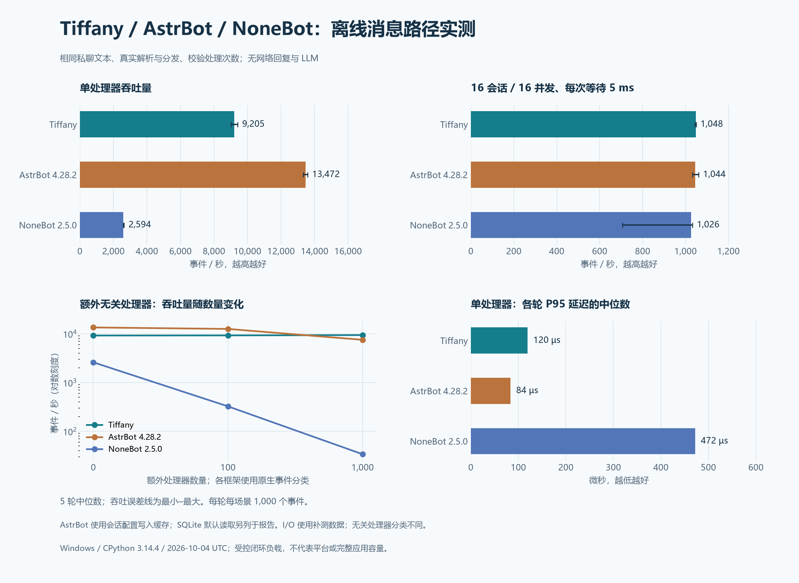

# Tiffany、AstrBot、NoneBot 离线性能对比

本文保留前一轮历史采样。当前 Tiffany 与另外两套框架的重新实测见 [当前对比报告](FRAMEWORK_COMPARISON.md)；本页数据不参与当前比较计算。

本次实际运行三套框架的消息解析与处理路径，使用相同的 OneBot V11 私聊文本和轻量业务。**Tiffany 并非所有场景最快：AstrBot 在会话配置命中进程写入缓存时，单处理器吞吐更高；Tiffany 的组件工作集更小，预热后的无关 Hook 路由更稳定。统一事件并发数后，模拟 I/O 场景的中位吞吐接近。**

这是组件级离线测量，没有连接 QQ / NapCat，没有发送真实回复，也没有调用 LLM。AstrBot 的完整应用、WebUI 和插件管理器没有启动；NoneBot 的网络驱动没有启动。因此不能据此给三个完整产品排总榜，或承诺线上消息容量。

本报告保留优化前 Tiffany 的历史结果。后续指标与调度改动及独立前后对照见 [性能优化报告](PERFORMANCE_OPTIMIZATION.md)；没有重新采样三套框架，不能将不同批次的新旧数字直接拼成排名。



[SVG 图表](../assets/performance/framework-comparison.svg) · [主测原始数据](../../benchmarks/results/archive/comparison/framework-comparison.json) · [统一并发补测数据](../../benchmarks/results/archive/comparison/framework-concurrency.json)

## 环境与版本

| 项目 | 本次设置 |
| --- | --- |
| 日期 | 2026-10-04；主测 17:45–17:50，统一并发补测 18:23–18:26，UTC+8 |
| 系统 | Windows 11，构建 26100，AMD64 |
| CPU | AMD Ryzen 9 7940H；16 个逻辑处理器 |
| Python | CPython 3.14.4，Anaconda 构建；三者共用同一隔离环境的解释器 |
| 事件循环 | Windows 默认 `ProactorEventLoop`，asyncio debug 关闭 |
| Tiffany | 本地源码，版本 0.1.0；测量时 HEAD 为 `11ba635e4517f0937196aec41cd37ac4c7930c77` |
| AstrBot | 官方 PyPI 包 [4.28.2](https://pypi.org/project/AstrBot/4.28.2/) |
| NoneBot | 官方 PyPI 包 [2.5.0](https://pypi.org/project/nonebot2/2.5.0/)；OneBot Adapter 2.4.6；`none + httpx` 驱动 |
| 关键依赖 | aiocqhttp 1.4.4、Pydantic 2.13.5、AnyIO 4.15.1、SQLAlchemy 2.0.54、aiosqlite 0.22.1、websockets 16.0、psutil 7.1.3 |
| 采样 | 每场景 5 轮，每轮 1,000 个事件；另有 100 个预热事件 |
| 进程隔离 | 每框架每轮新建子进程；轮换框架顺序及非基线场景顺序 |
| 日志与 GC | 框架日志设为 ERROR；GC 开启，显式 GC 在计时区间之外 |

全部已安装包版本记录于主测 JSON 和 [依赖快照](../../benchmarks/requirements-comparison.lock)。本机的 `D:\Projects\AstrBot` 未参与测试，避免其中的本地改动影响结果。运行目录和 AstrBot 数据库使用临时目录；比较环境位于 `.build-cache/`，不使用 Tiffany 的 `data/` 或服务器环境。

被测 Tiffany 核心、OneBot 字段实现和主测脚本的合并 SHA-256 为：

```text
33fa609c8d6229cea5c4f4e93e3e846a3d75a9d45380dfca346dec11b4a4c4ea
```

该指纹覆盖 `core/**/*.py`、`fields.py`、`adapters/onebot_fields.py` 与 `benchmarks/compare.py`。工作区文档改动未进入被测路径；HEAD 本身不能替代此指纹。补测 JSON 另外记录补测脚本的 SHA-256。

## 相同业务与原生处理路径

每个事件重新创建一个 OneBot V11 私聊字典，内容为一个文本段 `hello`。处理器通过各框架的原生接口读取文本，验证值，累计调用次数和字符数。模拟 I/O 场景在累计之前额外执行 `await asyncio.sleep(0.005)`。

| 框架 | 计时包含的路径 |
| --- | --- |
| Tiffany | 原始字典 → 事件分类 → `Envelope`（包括事件 ID）→ `Bot.emit()` → Runtime / Scheduler → Hook → `ctx.resolve(TEXT)` → 完成通知；包含当前队列、任务归属及指标维护 |
| NoneBot | 原始字典 → OneBot Adapter 的 `json_to_event()` → `Bot.handle_event()` → 原生事件分发、Matcher 检查、依赖注入 → `event.get_plaintext()` → 处理器完成 |
| AstrBot | 原始字典 → aiocqhttp Event → `AiocqhttpAdapter.convert_message()` → `AiocqhttpMessageEvent` → `PipelineScheduler.execute()` 的 9 个内置阶段 → 原生插件处理器 → `event.message_str` |

这些接口沿用各框架的设计。NoneBot 的分发入口及 Matcher 行为可对照[官方事件处理文档](https://nonebot.dev/docs/api/message)和[Matcher 文档](https://nonebot.dev/docs/api/matcher)；AstrBot 的事件与插件接口可对照[官方事件文档](https://docs.astrbot.app/dev/star/resources/astr_message_event.html)。解析、过滤和调度均未替换成自制分发循环。

AstrBot 安装原生处理器元数据，运行真实 SQLite 和 SharedPreferences，保留全部 9 个流水线阶段；关闭 LLM、STT、TTS、内容安全、限流、白名单和分段回复，私聊无需唤醒前缀。未使用的完整插件上下文设施采用最小占位对象；访问被禁用的会话设施会直接报错。没有测试插件发现、完整应用事件队列、网络收包或回复阶段的实际发送。

三者都使用同一个业务消费者，每轮结束断言：处理器调用数为 `事件数 × 匹配处理器数`，字符数为 `调用数 × 5`，无关处理器调用数为 0。所有主测及补测轮次均通过这些校验。

除 I/O 场景外，生产者逐个提交并等待处理完成；I/O 场景每个会话有一个生产者，也等待本次事件完成后再提交下一条。这是**闭环往返测量**，没有固定到达率下的饱和压测，也没有测量积压时的端到端延迟或丢弃率。

## 单处理器：吞吐、延迟与内存

**下表 AstrBot 使用进程写入缓存；其缺省 SQLite 路径单独列于下一节。** 吞吐量是 5 轮中位数；P95 / P99 是各轮对应分位数的中位数，未将所有轮次样本混为一个分布。

| 框架 / 条件 | 事件/秒 | 各轮最小–最大 | P95（µs） | P99（µs） | 预热后组件 RSS（MiB） |
| --- | ---: | ---: | ---: | ---: | ---: |
| Tiffany | 9,205 | 9,032–9,415 | 119.6 | 199.4 | 35.6 |
| AstrBot，配置命中写入缓存 | 13,472 | 13,317–13,591 | 83.6 | 152.9 | 238.3 |
| NoneBot | 2,594 | 2,578–2,637 | 472.2 | 597.3 | 62.6 |

本次缓存条件下，AstrBot 单处理器约为 Tiffany 的 1.46 倍；Tiffany 约为 NoneBot 的 3.55 倍。这些比例只描述表中的输入、配置和处理路径。

RSS 是新子进程完成基线组件初始化和预热后的工作集，以 MiB（2²⁰ 字节）换算，包含 Python 解释器和相关导入。它不是完整应用的空闲内存、内存峰值或长期运行容量；不能把 AstrBot 的这项数值当作其完整产品的部署要求。

### AstrBot 的配置读取条件

AstrBot 4.28.2 的 SharedPreferences 保留本进程写入的配置覆盖缓存。普通数据库读取不会自动把全部配置装入这一缓存。主测在计时之前通过真实 `put_async()` 写入测试会话的 `session_plugin_config` 和 `session_service_config`，值均为 `{}`，并等待持久化完成。这不是修改框架实现，也不是仅靠事件预热获得的读取缓存。

另一组测试通过真实 API 移除这两个配置项，使流水线按缺省值读取并查询真实 SQLite。该场景仍预热 100 次，**并非只测首次冷查询**。

| AstrBot 单处理器条件 | 事件/秒 | 各轮最小–最大 | P95（µs） |
| --- | ---: | ---: | ---: |
| 本进程写入配置，命中覆盖缓存 | 13,472 | 13,317–13,591 | 83.6 |
| 缺省配置项，读取落到 SQLite | 473 | 438–481 | 2,566.8 |

因此，13,472 不能代表所有新会话、重启后读取或默认配置路径的性能；473 也不能代表所有 AstrBot 插件。会话配置是否触发数据库访问，会改变此流水线的主要成本。图表中的 AstrBot 非 SQLite 数据全部使用第一种条件。

## 多处理器与无关处理器

| 场景 | Tiffany（事件/秒） | AstrBot，写入缓存（事件/秒） | NoneBot（事件/秒） |
| --- | ---: | ---: | ---: |
| 1 个匹配处理器 | 9,205 | 13,472 | 2,594 |
| 10 个匹配处理器 | 5,410 | 5,954 | 568 |
| 1 个匹配 + 100 个无关处理器 | 9,251 | 12,561 | 324 |
| 1 个匹配 + 1,000 个无关处理器 | 9,401 | 7,508 | 33.8 |

“无关”使用各自的原生分类：Tiffany / NoneBot 注册 `notice` 处理器；AstrBot 注册 `OnLLMResponseEvent` 处理器，输入均是私聊消息。**分类语义不同**，这一组用于观察原生注册表对无关类别的处理成本，没有比较相同复杂谓词，也不能推广为“安装 1,000 个真实插件后的性能”。一个插件可能注册多个处理器，还可能执行额外业务。

Tiffany 的注册表保持不变，路由缓存已经在预热时建立，所以该组无关 Hook 数量变化对吞吐影响很小。AstrBot 仍需扫描其处理器注册表并过滤事件类别；NoneBot 对同优先级 Matcher 启动检查任务，再执行原生检查。这些源码路径与本次增长趋势一致，尚未用 profiler 分解各项耗时。

10 个匹配处理器均执行同样的业务，但执行语义有差异：Tiffany / AstrBot 在事件路径中依次执行；NoneBot 同优先级 Matcher 可并行执行，本次使用 `block=False` 防止提前阻断。由于业务没有 I/O，这一组主要体现分发和调用开销，不能作为实际异步插件的并发评估。

## 模拟 I/O：先统一事件并发数

补测将三者都设为 **16 个会话生产者、最多 16 个在途事件**，每个处理器请求等待 5 ms。Tiffany 通过公开的 `scheduler.configure_adapter("benchmark", active_limit=16)` 设置，仍保留同一会话串行调度和全局 16 并发限制。AstrBot 继续采用上述配置写入缓存条件。

| 框架 | 中位事件/秒 | 各轮最小–最大 | P95（ms） | P99（ms） |
| --- | ---: | ---: | ---: | ---: |
| Tiffany | 1,048 | 1,043–1,049 | 16.05 | 16.52 |
| AstrBot，写入缓存 | 1,044 | 1,031–1,061 | 16.39 | 19.11 |
| NoneBot | 1,026 | 705–1,032 | 16.67 | 35.80 |

三者中位吞吐相差约 2%，本次不能据此认定 I/O 吞吐存在稳定的领先者。NoneBot 有一轮降到约 705 事件/秒，故图中保留完整最小–最大范围，不丢弃该轮，也不把范围当成置信区间。

第一轮方案保留 Tiffany 默认每 Adapter 4 并发，另两者由 16 个生产者并发执行；其结果也保留在主测 JSON 中：Tiffany 为 **263 事件/秒、P95 62.12 ms**。这包含并发配置不同的影响，不能直接拿它和另两者的 16 并发结果比较。补测只改变 Tiffany 的公开并发参数，未更改核心实现。

本机名义等待 5 ms 的场景，实际事件 P50 约为 15 ms；异步计时器和事件循环调度会影响实际等待时间。该结果应在 Linux 目标服务器重新采样，不能直接换算成服务器的网络或 LLM 容量。

## 对 Tiffany 的评价与后续测量

Tiffany 本次保留原始字典，只按需解析 `TEXT`，符合它避免不必要全量模型工作的设计；预热后的路由缓存表现与无关 Hook 数量变化的结果一致。组件工作集也较小，但本次没有单独测量字段策略对内存和速度的贡献。单处理器仍包含有界调度、任务生命周期和指标维护，测量没有为了更高数字绕开这些机制。

AstrBot 缓存流水线在最轻业务上更快，说明 Tiffany 仍有可以分析的调度与生命周期成本。NoneBot 的本次路径包含更完整的事件模型、Matcher 检查及依赖注入，性能数字应结合这些能力理解。**这些结果不评估插件生态、开发效率、功能完整性或运行可靠性，也不为这些维度打性能分。**

后续应在 Linux 上复测，并增加真实反向 WebSocket → `ping` → 假平台 API 回复链路、固定消息到达率、跨会话公平性、过载、长时运行和内存峰值。优化前先用 profiler 确认成本；保持 Tiffany 的核心约束：保留原始事件、同步按需字段、业务从 Hook 开始、调度和资源边界由运行时管理。

## 复测

测量脚本为 [compare.py](../../benchmarks/compare.py) 和 [compare_concurrency.py](../../benchmarks/compare_concurrency.py)，绘图为 [plot_comparison.py](../../benchmarks/plot_comparison.py)。比较依赖是可选开发工具，不进入服务器依赖集合。

在仓库根目录使用 Python 3.14.4；以下是 Windows PowerShell 命令：

```powershell
python -m venv .build-cache/framework-comparison-env
$benchPython = ".\.build-cache\framework-comparison-env\Scripts\python.exe"
& $benchPython -m pip install -r benchmarks/requirements-comparison.lock
& $benchPython -B -m benchmarks.compare
& $benchPython -B -m benchmarks.compare_concurrency

# 测量后再安装绘图库；绘图不会重新运行测试
& $benchPython -m pip install matplotlib==3.11.2
$env:MPLCONFIGDIR = Join-Path (Get-Location) '.build-cache/matplotlib-comparison'
& $benchPython -B -m benchmarks.plot_comparison
```

锁文件是本次 **Windows / CPython 3.14** 的完整版本快照，包含 Windows 专属依赖，未附包哈希；不是跨平台服务器锁文件。Linux 使用 Python 3.12+ 的独立环境，安装 [requirements-comparison.in](../../benchmarks/requirements-comparison.in) 后记录自己的完整依赖版本并重新测量，不能把两套环境的数字混为同一采样。Tiffany 本身的 Python 3.11 支持不受比较环境要求影响。

两个测量命令默认覆盖本文链接的 JSON，绘图默认覆盖 PNG / SVG。保留既有记录时为两个测量命令分别提供 `--output`，绘图用 `--input`、`--concurrency-input` 读取相应文件，再用 `--output` 指定图表文件名（不带扩展名）。`--events`、`--warmup`、`--repeats` 可调整采样；图表同时使用主测和补测结果，重新采样时应保持两者的设置一致。

测试期间未锁 CPU 频率、设置亲和性或隔离所有系统后台负载。5 轮结果足以展示本机的量级和波动，不构成跨机器、跨版本或线上工作负载的通用排名。
