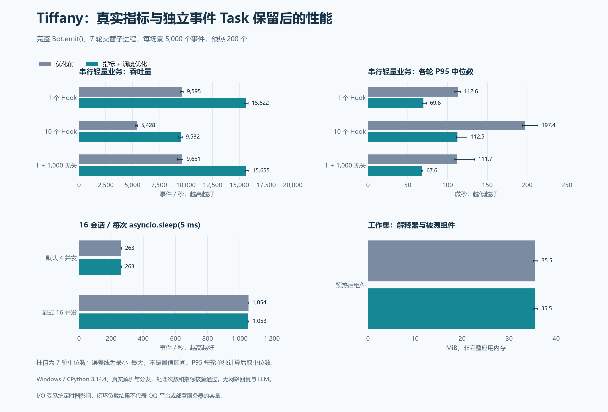

# Tiffany 功能不减的性能优化

本文保留 2026-10-04 指标与调度优化的采样和验收。后续整体检查及 OneBot 接纳优化见 [2026-10-05 代码检查记录](CODE_AUDIT.md)，两批数据各自对应下列源码指纹。

本轮优化指标热路径和事件调度，保留真实、逐事件、立即可见的指标，以及每条事件独立的 Task。公共 API、启动命令、配置格式和默认并发限制保持兼容。

完整单处理器路径的每事件平均耗时中位数 **104.2 → 64.0 µs，减少 38.6%**；吞吐 **9,595 → 15,622 事件/秒，提升 62.8%**，达到至少 20% 的耗时降低目标。两种模拟 I/O 场景基本持平，本批未发现稳定超过 5% 的吞吐或 P95 退化。

核心思想保持一致：**保留原始事件、按需解析字段、业务从 Hook 开始、运行时管理调度与资源生命周期。** Adapter 不提前构建业务对象，Provider 仍同步懒计算，Hook 仍使用当前事件 Context；性能收益来自减少标签规范化、重复指标写入、加锁和异步调度往返。



[SVG 图表](../assets/performance/tiffany-optimization.svg) · [完整前后数据](../../benchmarks/results/archive/optimization/tiffany-optimization.json) · [指标阶段数据](../../benchmarks/results/archive/optimization/tiffany-metrics-optimization.json)

## 完整前后结果

采样时间为 **2026-10-04 20:18–20:25，UTC+8**；下表均为各轮中位数，I/O 延迟单独使用 ms，串行场景使用 µs。

| 场景 | 吞吐：优化前 → 后（事件/秒） | 吞吐变化 | P95：优化前 → 后 | P99：优化前 → 后 |
| --- | ---: | ---: | ---: | ---: |
| 1 个 Hook | 9,595 → 15,622 | +62.8% | 112.6 → 69.6 µs | 178.1 → 106.6 µs |
| 10 个 Hook | 5,428 → 9,532 | +75.6% | 197.4 → 112.5 µs | 286.2 → 173.8 µs |
| 1 个匹配 + 1,000 个无关 Hook | 9,651 → 15,655 | +62.2% | 111.7 → 67.6 µs | 175.4 → 108.5 µs |
| 模拟 I/O，默认 4 并发 | 262.7 → 262.6 | −0.05% | 62.229 → 62.193 ms | 62.937 → 62.779 ms |
| 模拟 I/O，显式 16 并发 | 1,054.0 → 1,052.8 | −0.11% | 15.982 → 15.932 ms | 16.359 → 16.354 ms |

单处理器每事件平均耗时中位数从 104.226 降至 64.013 µs，减少 38.58%；逐事件 P50 的各轮中位数从 99.3 降至 60.6 µs，减少 39.0%。十处理器与无关处理器场景的每事件平均耗时分别减少 43.1%、38.4%。这是调度与指标固定成本下降后的离线收益，不能外推为网络等待或平台回复同比例提速。

单处理器预热后工作集的各轮中位数为 **35.47 → 35.46 MiB**，基本持平；其他场景也记录了 RSS，但同一子进程中的场景会共享解释器分配器历史，不应将这些值解释为各场景完全独立的内存成本。

模拟 I/O 的各轮吞吐区间：默认 4 并发优化前 262.42–263.02、后 262.17–262.87 事件/秒；16 并发前 1,052.04–1,055.53、后 1,050.72–1,056.66 事件/秒。前后波动范围重叠，吞吐和 P95 变化都小于 0.5%；没有靠调整默认并发获得 CPU 场景的提速。

最后一轮独立 cProfile 的 3,000 个预热后单处理器事件中，标签规范化从 **96,000 次（32 次/事件）降至 0 次**；首次绑定发生在预热阶段。原有 `set()` 共 60,000 次和后台调度 `_run()` 消失，新实现每事件提交 5 次指标批量写入、两次同步 `_pump()`。当前主要核心热点变为 `_batch`、`_bind`、`_record_state`；这些调用仍有成本。cProfile 会改变绝对耗时，其调用次数用于定位热点，不作为正式提速比例。

三阶段源码指纹如下；每批全部七轮使用相同版本，已核验完整对照的候选指纹与该轮测量时源码一致：

| 版本 | 合并 SHA-256 |
| --- | --- |
| 优化前 | `33fa609c8d6229cea5c4f4e93e3e846a3d75a9d45380dfca346dec11b4a4c4ea` |
| 仅指标优化 | `a3cf7283585fc1a40ea2367dc7d74aa7c055c5a539991ddaaa99d0fce303a75b` |
| 指标 + 调度优化 | `4603f36949bdad4adeedcacde74eca44374237bc2946050f9f15ad5bb4ed90d0` |

指纹覆盖 `core/**/*.py`、共用对比 helper、OneBot 字段 Provider 与共享 Field。测量器自身另存 SHA-256，JSON 同时记录解释器及依赖版本；测试和文档不在被测源码指纹内。

## 测量方法

| 项目 | 设置 |
| --- | --- |
| 系统与 CPU | Windows 11，构建 26100；AMD Ryzen 9 7940H，16 个逻辑处理器 |
| Python | CPython 3.14.4，Anaconda 构建；前后版本共用同一个解释器和依赖环境 |
| 事件循环 | 默认 ProactorEventLoop，asyncio debug 关闭 |
| 观测 | MetricRegistry 真实更新开启，Trace 关闭；GC 开启；日志级别 ERROR |
| 版本隔离 | 优化前源码只读快照与当前源码；每版每轮一个新子进程，在临时工作目录启动 |
| 样本 | 7 轮；每场景每轮 5,000 个事件，先预热 200 个，不计入测量 |
| 交替顺序 | 每轮交换前后版本执行顺序；单处理器始终最先测量，其余场景轮换 |
| 内存 | psutil 记录预热后的子进程 RSS 工作集，包含解释器与被测组件，未启动完整应用 |
| 热点 | 最后一轮另跑 3,000 个单处理器事件的 cProfile，独立预热，不污染正式耗时 |

各场景都创建原始 OneBot V11 私聊字典，通过实际字段 Provider 读取文本，再执行完整 `Bot.emit()`，计时直到 Hook 完成。一个处理器读取文本并累计字符数；十处理器场景每个 Hook 都执行；无关处理器以原生 `notice` 路由注册，不应执行。每轮校验实际调用次数、字符数和未匹配处理器零调用。

模拟 I/O 使用 16 个会话，每条事件等待 `asyncio.sleep(0.005)`；分别保持默认 Adapter 4 并发和显式 16 并发，全局上限都是 16。同会话串行，生产者等上一条完成才提交下一条。Windows 定时器可能让 5 ms 等待实际接近 15 ms，应以数据为准；这属于闭环负载，不代表开放式消息到达下的排队延迟。

关闭前检查接纳次数、事件耗时 count、每个 Hook 的执行次数均为 5,200，并确认全局排队和活动计数归零、owner 引用释放。正式完整对照共测量 350,000 个事件；预热和单独热点采样另计。

吞吐量、每事件平均耗时和 P50/P95/P99 均先在每轮计算，再取七轮中位数。串行场景的“每事件耗时”是该轮总耗时除以事件数；I/O 并发场景的这个商表示吞吐成本，不能当作单个事件延迟。图中误差线为各轮最小–最大，不是置信区间。未固定 CPU 频率或隔离系统后台负载。

## 实现与功能边界

### 指标阶段

`MetricRegistry._bind()` 仅在首次使用时校验、规范化名称与标签，命中时复用不可变绑定。加权 LRU 按指标键数量限制，不超过现有 `max_series`，只保存元数据，不持有事件、Hook 或 owner。首次绑定不创建零值序列；驱逐只影响绑定缓存，不删除已导出的值。

`_batch()` 在与 `snapshot()` 相同的线程锁下按原顺序写入，同一次状态转换中的全局与 Adapter 指标保持一致。序列上限与每次拒绝创建的计数保持原规则；`observe()` 的 count/sum 也在同一次锁内更新。Hook 完成一次写入执行次数、耗时 count/sum，事件完成一次写入耗时 count/sum。容量未改变时跳过实际赋值，水位仅在接纳时更新。

绑定属于具体 Registry；组件每次从当前 Registry 获取绑定，替换后不会继续更新旧实例。公开 `inc/set/set_max/observe/snapshot` 和原指标名称、标签、单位、结果分类保持不变，没有采样或延迟汇总。

阶段一单独完成 7 轮单处理器对照：每事件耗时 **104.1 → 82.1 µs，减少 21.1%**；吞吐 **9,609 → 12,179 事件/秒**；P95 **111.9 → 88.9 µs**。这是一批独立测量，只用于确认指标阶段收益，不能和完整对照拼接计算调度阶段的增益。

### 调度阶段

事件先进入原有会话队列，接纳、完成、排队取消和并发配置调整直接触发同步 `_pump()`。保留跨会话 ready 队列轮转、同会话 FIFO、Adapter/global 限制，以及排队加活动事件总容量。重入保护兼容 eager Task 和业务中再次提交事件。

每个事件仍通过 TaskRegistry 创建独立 Task，使用启动时调度上下文的副本，防止提交者或上一个事件的 ContextVar 状态传入下一条。`wait=True` 直接等待完成 Future，等待者取消时显式撤销排队事件或取消活动 Task；`wait=False` 返回原 Future，取消结果等待不会取消已接纳业务。

Work 明确排队、活动、结束状态；统一完成路径只执行一次。Task 启动前就取消时，完成回调释放活动计数和 owner；拒绝取消的业务继续占用活动状态并持有资源引用。移除后台调度循环、无消费者的 Condition 与重复 Task 集合，使用活动 Work 映射和空闲 Event 维护关闭等待。

Task 创建或内部派发失败时回滚预留状态，记录 Runtime 首个关键故障并请求 abort；普通 Hook 错误继续遵循原有策略。drain、abort、停止预算与 Scope 卸载语义延续原实现，Scope 取消未收敛仍保留必要资源并报告失败。

## 回归与交付

原有 185 项测试继续覆盖；新增 8 项指标回归和 15 项调度回归，共 208 项。指标测试检查结果等价、校验复用、LRU 有界、序列上限、跨 Registry、NaN 和多线程快照。调度测试覆盖启动前取消、运行中取消、拒绝取消、完成/取消竞争、上下文隔离、动态限制、排队卸载、eager 重入、内部派发故障及完成时内部故障。原调度与生命周期测试继续验证公平性、FIFO、过载、drain 升级 abort 和资源清理。真实 HTTP 测试同时检查新热路径产生的 OpenMetrics 输出。

Windows Python 3.14.4 完整测试通过；按原规则跳过 4 项 POSIX 信号测试。现有 CI 保留 Linux Python 3.11～3.14、Windows Python 3.11/3.14，Python 3.11 另跳过不支持的 eager Task 测试。不设置依赖共享机器速度的性能硬门槛；本机没有执行 Linux CI，不声称完成目标服务器性能或真实平台长时验收。

本地 `.build-cache/optimization/before/` 保留优化前源码与逐文件 SHA-256 清单；`metrics-stage/` 保留第一阶段源码，`final-stage/` 保留最终源码，`metrics-stage.patch`、`scheduler-stage.patch` 是两阶段独立生产代码差异。该缓存目录不进入发布包或 Git，用于本次复测与分阶段回退。

新实现默认生效，不新增配置或数据迁移。部署更新继续采用停止并等待清理、覆盖程序文件、重新启动；保留 `data/`。应用回退应覆盖回上一版本程序，保留数据目录。此前 [三框架报告](FRAMEWORK_COMPARISON.md) 和 [历史微基准](../BENCHMARKS.md) 的数据与图表继续保留。

## 复测

完整对照仅额外需要 psutil；绘图另需 Matplotlib。可以复用三框架对比的依赖环境，也可以使用仅包含这些依赖及 Tiffany 核心依赖的同一环境，前后版本必须一致。

```powershell
# 在应用优化改动前保存源码；路径已存在时会拒绝覆盖
python -B -m benchmarks.optimize --snapshot .build-cache/optimization/before

# 本次工作区保存了该轮前后快照，复测相同版本和场景
python -B -m benchmarks.optimize --baseline .build-cache/optimization/before --candidate .build-cache/optimization/final-stage --cases one_handler ten_handlers unmatched_1000 io_4 io_16 --events 5000 --warmup 200 --repeats 7

# 只对已保存的原始数据绘图
python -B -m benchmarks.plot_optimization
```

若当前仓库已是优化后的版本，先准备优化前源码副本和有效的 `baseline-manifest.json`，再用 `--baseline` 指定；不要把当前实现的快照作为“优化前”。可以用 `--output` 保存另一份结果，避免覆盖本报告数据。源码指纹、依赖、解释器、逐轮值和独立热点记录都保存在 JSON 中。

正式验收只使用真实指标和完整 `Bot.emit()` 的数据。暂停指标或绕过 Runtime 的 Dispatcher 诊断数字不能用于宣称提速；这里的结果仅适用于本机上述离线业务，平台回复、登录、网络和生产业务的容量需要另行测量。
