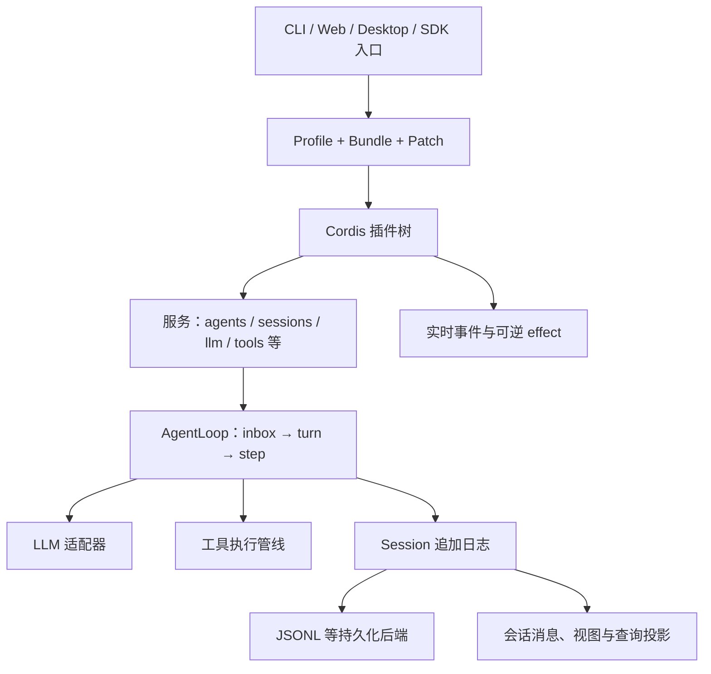

# DeepSeek Harness 架构与设计思想：对 Tiffany 的启发

> 源码基线：`D:\Applications\ds-harness\deepseek-harness`，提交 `0d1f50007f9bca3f52b06e1c3074fa14d5fb0720`。分析日期：2026-09-29。本文依据该版本的架构文档和关键实现作静态分析，关注运行机制与设计取舍，不是逐文件审计或运行测试报告。下文的 dsh 链接按这两个项目当前的同盘目录布局编写。

Tiffany 对照状态更新于 2026-10-06：Scope 资源归属、TaskRegistry 监督、OneBot Token 鉴权和真实本机入口测试均已实现；通过配置组合扩展仍属规划。现行接口与默认值以 [文档导航](../README.md) 为准，dsh 研究基线保持上述版本。

## 一、核心结论

dsh 的基本单位是**有生命周期的插件**。Cordis 提供上下文、服务依赖、事件和可逆的 effect；Profile 决定安装哪些插件；AgentLoop 是一个可替换的驱动插件；Session 日志保存需要恢复的事实，会话相关的消息、视图和查询可从这些事实投影出来。dsh 的优势是扩展点与资源归属明确，适合大量独立能力并存的产品；代价是插件状态、配置层和跨包调用链比较难追踪。[架构总览](../../../../../Applications/ds-harness/deepseek-harness/docs/architecture.zh.md)、[Cordis 概念](../../../../../Applications/ds-harness/deepseek-harness/docs/cordis-primer.zh.md)。

对 Tiffany 最有价值的是先落实两件事：**让 Scope 统一拥有注册与清理动作**，以及**用稳定 ID 从配置组装功能**。其余理念可按真实需求逐步引入。

## 二、总体结构



| 层 | 职责 | 主要依据 |
| --- | --- | --- |
| 启动与组合 | Profile 选择 bundle；按稳定 ID 应用配置 patch；长驻界面可重载用户层 | [架构](../../../../../Applications/ds-harness/deepseek-harness/docs/architecture.zh.md)、[profile.ts](../../../../../Applications/ds-harness/deepseek-harness/packages/boot/app-boot/src/profile.ts)（1–13、138–159、926–940） |
| 插件运行时 | 服务注入、插件状态、effect 所有权、卸载等待 | [Cordis fiber.ts](../../../../../Applications/ds-harness/deepseek-harness/vendor/cordis/src/fiber.ts)（181–204、265–318、415–548） |
| Agent 控制面 | 活跃 Agent 注册、创建/恢复、会话与驱动的配对生命周期 | [AgentRegistry](../../../../../Applications/ds-harness/deepseek-harness/packages/core/agent/src/index.ts)（388–438、456–555） |
| 执行面 | 一个 turn 包含多个 step；每个 step 组装请求、调用模型、执行工具 | [agent.ts](../../../../../Applications/ds-harness/deepseek-harness/packages/core/agent-loop/src/agent.ts)（241–340、353–493） |
| 事实与视图 | Session 事件日志、模型消息历史及其他增量投影 | [Session](../../../../../Applications/ds-harness/deepseek-harness/packages/core/session/src/index.ts)（682–769、823–861）、[ProjectionRegistry](../../../../../Applications/ds-harness/deepseek-harness/packages/session/session-projection/src/index.ts)（199–223、319–351） |
| 外部能力 | LLM 适配器、工具注册表、权限与沙箱等可替换服务 | [LlmRuntime](../../../../../Applications/ds-harness/deepseek-harness/packages/llm/llm/src/index.ts)（333–416、912–961）、[ToolRuntime](../../../../../Applications/ds-harness/deepseek-harness/packages/core/tools/src/index.ts)（1043–1067、1348–1367） |
| 持久化与验证 | JSONL 后端、版本代际、运行时不变量、分层测试 | [JSONL 后端](../../../../../Applications/ds-harness/deepseek-harness/packages/session/session-persistence-jsonl/src/index.ts)（1–55、117–132）、[测试策略](../../../../../Applications/ds-harness/deepseek-harness/docs/testing.zh.md) |

交付入口也遵守这套组合：CLI 以具名 Profile 启动 Web、Headless、SDK、ACP 等模式；桌面应用把匹配版本的后端与客户端装入宿主进程，通过带版本的字节管道连接渲染侧，不开放本地 Web 端口；Python SDK 则通过随包运行时选择 SDK Profile。这让同一服务与插件约定跨入口复用，但发布和版本配套的成本也更高。[应用与桌面入口](../../../../../Applications/ds-harness/deepseek-harness/docs/architecture.zh.md)（应用启动、桌面应用节）、[Profile 模板](../../../../../Applications/ds-harness/deepseek-harness/packages/boot/app-boot/src/profile.ts)（138–159）。

### 2.1 Profile 是组合入口

dsh 把同一批服务按使用场景装成 `web`、`headless`、`sdk`、`acp` 等 Profile。Profile 由 bundle 和用户 patch 层组成；patch 通过稳定 ID 定位条目，后层可覆盖配置、停用或增加条目。`composeEntries()` 与实际启动共用 `applyEntryPatches()`，`--dump-config` 能展示最终组合和来源，因此配置不是一份只能靠猜测解释的 YAML。[Profile 模板](../../../../../Applications/ds-harness/deepseek-harness/packages/boot/app-boot/src/profile.ts)（138–159、926–940）、[基础 bundle](../../../../../Applications/ds-harness/deepseek-harness/packages/bundle/base/cordis.patch.yml)（1–27）、[配置转储](../../../../../Applications/ds-harness/deepseek-harness/packages/boot/app-boot/src/index.ts)（392–485）。

配置行顺序主要服务于阅读，插件是否激活由服务可用性决定。dsh 针对长驻 Web 使用配置热重载；一次性或 stdio 入口只在启动时应用，以免运行中的工作突然失去依赖。[Profile 说明](../../../../../Applications/ds-harness/deepseek-harness/docs/architecture.zh.md)。

### 2.2 Cordis 把依赖与所有权放在同一个插件上下文

插件声明 `inject`，在必需服务可用后激活；其 `fiber` 记录 `PENDING → LOADING → ACTIVE → UNLOADING → DISPOSED` 等状态。`ctx.effect()` 安装资源并返回 disposer；卸载插件时撤销它拥有的注册、定时器、子插件和其他资源。源代码把子 fiber 的 `dispose` 绑定到父 fiber，并等待卸载完成。[教程](../../../../../Applications/ds-harness/deepseek-harness/docs/cordis-tutorial/02-lifecycle-and-effects.zh.md)（5–94）、[Fiber](../../../../../Applications/ds-harness/deepseek-harness/vendor/cordis/src/fiber.ts)（184–204、265–318、415–548）。

这里的关键思想是：**注册与撤销是同一个操作的两端，所有权在注册时确定**。例如 `ctx.tools.register()` 返回精确撤销函数，注册本身进入调用插件的 effect 范围。[工具注册](../../../../../Applications/ds-harness/deepseek-harness/packages/core/tools/src/index.ts)（1038–1067）。对于必须按顺序拆除的资源，dsh 把清理步骤放进同一个 effect；不能假定多个异步 disposer 会按简单的反向列表依次完成。[生命周期教程](../../../../../Applications/ds-harness/deepseek-harness/docs/cordis-tutorial/02-lifecycle-and-effects.zh.md)（84–94）。

### 2.3 服务是能力，事件是扩展点

服务提供直接调用的能力，如 `ctx.llm`、`ctx.tools`、`ctx.sessions`；`inject` 表达调用前置条件。dsh 的“能力 seam”同时考虑**接口定义、提供方和消费方**，这样替换提供方时消费方无需依赖某一实现。[能力说明](../../../../../Applications/ds-harness/deepseek-harness/docs/architecture.zh.md)（能力 seam 节）、[LLM 注册与准备](../../../../../Applications/ds-harness/deepseek-harness/packages/llm/llm/src/index.ts)（383–416、912–961）。

事件有不同的公开语义：`emit` 用于观察，`serial` 用于有序异步处理，`parallel` 用于并行通知，`waterfall` 用于可包裹、可短路的策略链，`bail` 在取得决定后停止。dsh 还把事件分成三类：需恢复的 **Session 事实**、只描述正在运行工作的 **Agent 实时事件**、附着在某项能力上的 **能力事件**。这避免把“曾经发生的事实”和“当前进程中的通知”混成一条总线。[事件模式](../../../../../Applications/ds-harness/deepseek-harness/docs/cordis-primer.zh.md)（17–39）、[事件域](../../../../../Applications/ds-harness/deepseek-harness/docs/architecture.zh.md)（事件节）。

Agent 作用域同时控制注册所有权与可见性：`createScope()` 返回带上下文的所有权边界，`scopeTarget()` 用不透明身份决定哪些作用域监听器能收到事件；一个全局监听器仍可观察所有 Agent。[作用域说明](../../../../../Applications/ds-harness/deepseek-harness/docs/subsystems/scope.zh.md)、[源码](../../../../../Applications/ds-harness/deepseek-harness/packages/core/scope/src/index.ts)（129–184）。

## 三、关键执行链

### 3.1 Agent 创建与停止

`AgentRegistry.create()` 向注册的工厂请求 Agent；AgentLoop 声明 `agents`、`sessions`、`llm`、`tools`、`systemPrompt`、`sessionProjections` 等依赖。Agent 在完成准备后进入注册表，`agent/created` 监听器串行执行，失败会回滚；同 ID 的并发创建以注册表插入作为最终冲突边界。撤销时按确切实例身份删除，避免旧句柄误删新实例。[AgentLoop 依赖](../../../../../Applications/ds-harness/deepseek-harness/packages/core/agent-loop/src/index.ts)（357–419）、[AgentRegistry](../../../../../Applications/ds-harness/deepseek-harness/packages/core/agent/src/index.ts)（388–438、456–555）。

这体现两个约定：对外宣布“创建完成”之前要保证依赖和所有权已建立；`dispose()` 返回时要达到**完全停稳**，不能只发送取消信号。[防御性模式](../../../../../Applications/ds-harness/deepseek-harness/docs/defensive-patterns.zh.md)（21–27）。

### 3.2 一次 turn / step

```text
inbox 领取输入
  → 记录 turn/start
  → agent/pre-step 允许、改写或拒绝
  → 记录 step/start
  → agent/request 选路，并 prepareCall 绑定适配器版本
  → 记录 system/user/request header 等被接纳的输入
  → 从 Session 日志派生并冻结模型请求
  → 流式调用 LLM，发布实时 stream
  → 记录 assistant/message 或 assistant/attempt
  → 记录 tool/call，经过工具管线，记录 tool/result
  → 记录 step/end；必要时进入下一 step
  → 记录 turn/end
```

`turn()` 用 `finally` 记录边界结束，`step()` 在异步 `prepareCall()` 之后才把接纳的系统和用户内容写入日志；取消发生在准备阶段时不会留下虚假的已接纳输入。LLM 准备阶段把模型能力与实际流式分派绑定到同一适配器代际，避免配置热替换造成“按 A 的能力记账、由 B 实际执行”。[turn/step 源码](../../../../../Applications/ds-harness/deepseek-harness/packages/core/agent-loop/src/agent.ts)（270–340、353–380、501–550）、[LLM 准备调用](../../../../../Applications/ds-harness/deepseek-harness/packages/llm/llm/src/index.ts)（912–961）。

成功的 Assistant 消息和可恢复的失败尝试均有日志结算；工具调用先写 `tool/call`，结果写 `tool/result` 并引用调用的序号。实时 stream 为界面提供增量，日志中的结算结果为恢复与回放提供事实。[Assistant 结算](../../../../../Applications/ds-harness/deepseek-harness/packages/core/agent-loop/src/agent.ts)（381–493）、[工具事件对](../../../../../Applications/ds-harness/deepseek-harness/packages/core/agent-loop/src/tool-calls.ts)（249–289）。

### 3.3 工具执行是一条分阶段管线

工具管线依次处理参数快照、`tools/pre-execute` 策略、审批、不可被后续允许决策放宽的 guard、`tools/execute` 环绕执行、`tools/post-execute` 结果处理、工具自身的内容收尾以及最终通知。调用方提供取消信号；工具体已启动时，取消不会直接遗弃它，运行时等待它停稳后再形成最终结果。拒绝、异常和取消会归一化为可记录的工具结果。[管线图](../../../../../Applications/ds-harness/deepseek-harness/docs/tool-execution-pipeline.zh.md)、[执行入口与预处理](../../../../../Applications/ds-harness/deepseek-harness/packages/core/tools/src/index.ts)（1348–1367、1370–1515）、[工具体](../../../../../Applications/ds-harness/deepseek-harness/packages/core/tools/src/index.ts)（1536–1568）。

这条链使权限、超时、沙箱、重试与结果展示可以由不同插件贡献，同时固定**谁有最终否决权**。Tiffany 若要引入类似管线，应先确认消息 Hook 是否具有相应的策略和安全需求。

### 3.4 Session 日志、投影和持久化

`Session.append()` 先对输入做可无损 JSON 表示的快照与校验，再分配连续序号并追加；一旦接受，观察者失败会被隔离，不改变已提交事实。`deriveMessages()` 从带 `surfaceOp` 的消息事件构建模型历史，其他实时或控制事件不会误入请求。投影服务再把日志折叠为面向 host 或客户端的状态，并带 `asOfSeq` 表示读取位置。[Session 追加](../../../../../Applications/ds-harness/deepseek-harness/packages/core/session/src/index.ts)（682–769）、[历史派生](../../../../../Applications/ds-harness/deepseek-harness/packages/core/session/src/index.ts)（823–861）、[投影](../../../../../Applications/ds-harness/deepseek-harness/packages/session/session-projection/src/index.ts)（199–223、319–351）。

“模型可见即已记录”是 dsh 的核心一致性约束：一个运行时不变量直接比较发往 LLM 的消息与 `session.deriveMessages()` 的重建结果。持久化后端只负责物理存储、读取、租约和格式代际；Agent 层负责中断轮次的语义修复。旧代际保留原文件，新代际经迁移校验后另行发布。[架构约束](../../../../../Applications/ds-harness/deepseek-harness/docs/architecture.zh.md)（会话日志节）、[请求不变量](../../../../../Applications/ds-harness/deepseek-harness/packages/core/agent-loop/src/invariant.ts)（19–56）、[JSONL 后端](../../../../../Applications/ds-harness/deepseek-harness/packages/session/session-persistence-jsonl/src/index.ts)（1–55、117–132）、[恢复入口](../../../../../Applications/ds-harness/deepseek-harness/packages/core/agent-loop/src/index.ts)（889–914）。

## 四、贯穿架构的设计思想

1. **以能力为依赖单位。** 上层要的是服务能力，不是某个具体适配器；依赖在配置或插件声明中显式表达，缺失时尽早失败或保持可诊断的待激活状态。[Cordis](../../../../../Applications/ds-harness/deepseek-harness/docs/cordis-primer.zh.md)、[能力 seam](../../../../../Applications/ds-harness/deepseek-harness/docs/architecture.zh.md)。
2. **注册即拥有，卸载即结清。** Effect 同时覆盖监听器、工具、连接和子插件；完全停稳是卸载边界。[Effect 教程](../../../../../Applications/ds-harness/deepseek-harness/docs/cordis-tutorial/02-lifecycle-and-effects.zh.md)、[Fiber 源码](../../../../../Applications/ds-harness/deepseek-harness/vendor/cordis/src/fiber.ts)。
3. **让事件语义显式。** 事实事件、运行中通知与策略拦截有不同持久性和分发方式；新增行为通常挂在能力或事件扩展点。[架构事件节](../../../../../Applications/ds-harness/deepseek-harness/docs/architecture.zh.md)、[事件模式](../../../../../Applications/ds-harness/deepseek-harness/docs/cordis-primer.zh.md)。
4. **在承诺前验证，在承诺后保持一致。** Session 追加前校验；LLM 请求先确定路由再记录模型可见输入；工具执行先过策略与守卫。[Session.append](../../../../../Applications/ds-harness/deepseek-harness/packages/core/session/src/index.ts)、[Agent.step](../../../../../Applications/ds-harness/deepseek-harness/packages/core/agent-loop/src/agent.ts)、[ToolRuntime](../../../../../Applications/ds-harness/deepseek-harness/packages/core/tools/src/index.ts)。
5. **以独立事实检测漂移。** 不变量需要比较两条可能分叉的观察路径，例如“日志重建消息”与“真实 LLM 请求”；只检查服务是否存在意义不大。[不变量服务](../../../../../Applications/ds-harness/deepseek-harness/packages/runtime-diagnostics/invariants/src/index.ts)（1–5、128–196）、[具体例子](../../../../../Applications/ds-harness/deepseek-harness/packages/core/agent-loop/src/invariant.ts)（19–56）。
6. **测试已交付组合。** dsh 除单元测试外，还测真实启动 Profile、构建产物、无密钥录制会话回放、外部 API 和浏览器输出；这弥补手动挂载插件的测试无法覆盖 loader 与发布入口的缺口。[测试策略](../../../../../Applications/ds-harness/deepseek-harness/docs/testing.zh.md)。

## 五、设计代价与边界

- **复杂度随插件和配置层增长。** 一个行为可能经过 Profile、Loader、服务、事件和 effect 才执行。dsh 为此提供配置转储、依赖图、事件生产消费图和诊断状态。[配置转储实现](../../../../../Applications/ds-harness/deepseek-harness/packages/boot/app-boot/src/index.ts)（392–485）、[模块图](../../../../../Applications/ds-harness/deepseek-harness/docs/module-graph.zh.md)、[事件图](../../../../../Applications/ds-harness/deepseek-harness/docs/event-producer-consumer.zh.md)。
- **依赖等待可能掩盖配置错误。** `PENDING` 是合法状态；缺少服务时插件可一直不启动，需要状态诊断和明确的启动校验。[组合与 HMR 教程](../../../../../Applications/ds-harness/deepseek-harness/docs/cordis-tutorial/06-composition-and-hmr.zh.md)（诊断节）。
- **可靠恢复需要昂贵约定。** 事件格式、物理代际、迁移、租约、快照与回放都要维护。只有当“跨重启恢复精确历史”是产品需求时，这套成本才值得引入。[会话日志](../../../../../Applications/ds-harness/deepseek-harness/docs/architecture.zh.md)、[JSONL 后端](../../../../../Applications/ds-harness/deepseek-harness/packages/session/session-persistence-jsonl/README.zh.md)。
- **安全边界由部署决定。** dsh 自身明确标注为开发者预览，尚未接受安全审计；沙箱和审批不能单独构成安全保证。其高风险工具管线适合作为设计参考，不能被理解为可直接继承的安全性。[安全说明](../../../../../Applications/ds-harness/deepseek-harness/SAFETY.zh.md)、[工具管线](../../../../../Applications/ds-harness/deepseek-harness/docs/tool-execution-pipeline.zh.md)。

## 六、Tiffany 的可执行启发

Tiffany 已有 [Bot 外观](../../core/Bot.py)、[Scope](../../core/Scope.py)、[Provider/Service 注册表](../../core/Provider.py)、[有界调度器](../../core/EventScheduler.py)和 OneBot 适配器。这些是可以承接 dsh 思想的基础。[application.py](../../application.py) 与 [hooks/__init__.py](../../hooks/__init__.py) 当前固定组合功能。分析时，[Bot.unload](../../core/Bot.py) 直接整理多个 Runtime 私有集合；本轮优化已将资源清理收回 [Runtime](../../core/Runtime.py)，由 Bot 保留卸载协调。

### 优先级 A：统一 Scope 的资源归属和停稳边界

**做法：**让 `Scope` 在注册 Hook、Provider、Service、Adapter、任务或 lifespan 时同时取得清理能力。`Runtime` 提供一个按 owner 停止接纳、等待在途事件与任务、按依赖顺序清理、报告剩余资源的公共操作；`Bot.unload()` 只负责协调和返回报告。启动失败沿同一套清理路径回滚。现有句柄和 owner 检查可以继续使用，无需引入 Cordis。[dsh 的 Effect](../../../../../Applications/ds-harness/deepseek-harness/docs/cordis-tutorial/02-lifecycle-and-effects.zh.md)、[Tiffany Scope](../../core/Scope.py)、[Tiffany 卸载实现](../../core/Bot.py)。

**验收：**重复卸载幂等；在途事件完成或被明确取消；清理失败保留可见报告；一个 owner 的资源不会误伤其他 owner。分析时，[Runtime](../../core/Runtime.py) 遍历整个事件循环的 `asyncio.all_tasks()`，会把宿主程序自己的任务记为 Tiffany 遗留任务；本轮已改为只依据框架任务注册表报告残留，并增加回归测试。

### 优先级 B：用稳定 ID 做启动时功能组合

**做法：**在 `Tiffany.toml` 中列出启用的插件 ID 与各自配置；由一张显式注册表把 ID 映射到 `register(scope, config)`，每项得到独立 Scope。先解析和校验完整配置，再安装适配器和功能，最后启动 Runtime。输出一份“最终启用项及来源”的诊断视图。dsh 的 Profile 展示了稳定 ID 和有效配置可检查的价值；Tiffany 第一阶段仅需单层 TOML 和静态组合。[dsh Profile](../../../../../Applications/ds-harness/deepseek-harness/docs/architecture.zh.md)、[Tiffany 当前入口](../../application.py)、[当前固定 Hook 注册](../../hooks/__init__.py)。

**验收：**未知或重复 ID 启动时报错；缺失的 Field/Service 依赖在启动前说明原因；启停 `ping` 不需改 `application.py`；同一配置始终得到相同的组装结果。

### 后续按需求吸收

| 触发条件 | 可吸收的做法 | Tiffany 的最小落点 |
| --- | --- | --- |
| 多个适配器、策略插件开始共用事件 | 区分通知事件、可拦截决策和必须保存的事实 | 给事件类型标记分发语义；继续保持 Hook 事件派发简单 |
| 需要跨重启重放、审计或故障恢复 | 追加式事实日志与纯投影 | 先定义事件 envelope 和版本，再决定 JSONL/数据库实现 |
| Hook 或插件热替换成为真实需求 | 卸载旧 Scope 至停稳，再激活新 Scope | 先完成 A 的资源归属与竞态测试，再增加热替换 |
| 对外开放 OneBot WebSocket | 在接入处校验身份和权限 | [适配器](../../adapters/OneBotWebSocketAdapter.py) 已在握手阶段检查 Bearer Token；非回环绑定要求 Token，仍只接受一个活动连接。应用权限判断沿用 Hook |
| 项目供他人安装或协作 | 真实入口测试、配置示例、架构约束检查 | 使用说明见 [README](../../README.md)，源码分类见 [代码地图](../CODE_MAP.md)，测试分类见 [测试导航](../../tests/README.md)；已有 [发布入口](../../tests/integration/deployment/test_release.py)、[健康与鉴权](../../tests/integration/deployment/test_health.py)、[分层隔离](../../tests/unit/core/test_layering.py) 验证 |

## 七、结语

dsh 最值得学习的是一组相互支撑的约定：**能力由服务暴露，扩展由事件承接，资源由 Scope/effect 拥有，长期事实由日志保存，跨组件一致性由可执行不变量证明**。Tiffany 的规模更小；先做资源归属与可诊断的静态组合，便能获得主要收益，同时保留现有框架的易理解性。本轮按“不增加新功能”的要求只落实内部清理和性能优化，静态组合仍是后续可选方向。
