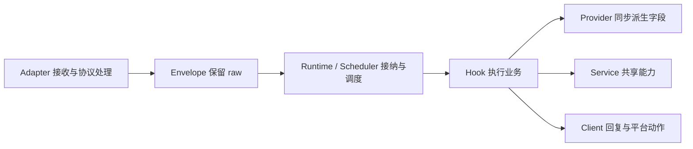

# 架构与开发约束

Tiffany 是平台无关的异步 Hook Runtime。核心约束是 **保留原始事件、按需读取字段、用 Hook 编写业务**。当前公开入口见 [源码地图](../development/code-map.md)，完整扩展示例见 [学习路线](../development/learning-guide.md)。

## 事件处理链

Adapter 解码协议，处理鉴权、心跳与控制帧，只探测路由和会话所需的元数据。`Envelope.raw` 保留原始事件，业务可以读取平台特有数据。`Runtime` 管理快照、任务和生命周期，`Scheduler` 决定何时执行，`Dispatcher` 决定执行哪些 Hook。

同一事件中的 Hook 共用 `Context`。`needs` 用于依赖校验；只有 `ctx.resolve(field)` 才计算字段，结果缓存在当前事件中。Provider 同步派生数据，网络、数据库和其他异步工作放在 Hook 或 Service。`ctx.put()` 可向后续 Hook 发布已计算的结果。

## 模块职责

| 层 | 职责 | 源码入口 |
| --- | --- | --- |
| `core/` | 路由、字段解析、调度、任务监督和资源生命周期 | [Bot](../../core/Bot.py)、[Runtime](../../core/Runtime.py)、[Dispatcher](../../core/Dispatcher.py) |
| `adapters/` | 连接、协议控制、事件接纳和平台字段 Provider | [Adapter](../../adapters/Adapter.py)、[接入工厂](../../adapters/__init__.py) |
| `clients/` | 异步回复、平台 API、认证与调用额度 | [Client](../../clients/Client.py) |
| `hooks/` | 业务判断与派生字段 | [业务注册](../../hooks/__init__.py)、[Ping](../../hooks/ping.py) |
| 应用组合层 | 读取配置，组装业务、接入、路径与健康服务 | [application.py](../../application.py)、[settings.py](../../settings.py) |
| `deployment/` | 环境准备、配置向导、凭据、日志和进程监督 | [启动器](../../deployment/launcher.py) |
| `shared/` | 只依赖标准库的跨层路径与调度约定 | [路径](../../shared/paths.py)、[调度策略](../../shared/scheduler.py) |

`core` 不导入具体协议、业务或部署模块；标准库启动器能在应用依赖安装前运行。这个边界由 [分层测试](../../tests/unit/core/test_layering.py) 验证。

## 依赖与资源归属

`Field` 和 `ServiceKey` 按对象身份区分，名称仅用于诊断。多个模块应导入同一个键实例；应用已有的公共字段集中在 [fields.py](../../fields.py)。Provider 用 `requires` 声明字段依赖，Hook 用 `needs`、`uses` 声明字段和服务需求，Service 注册时声明服务依赖。

Scope 将 Hook、Provider、Service 和生命周期资源归于同一个 owner；后台任务通过 `runtime.tasks.spawn(..., owner=...)` 监督。共享服务只注册一次，消费者声明依赖。卸载存在消费者的提供者时，依赖校验会阻止错误清理。

启动失败需要回滚已取得的资源。关闭与卸载先处理在途事件和任务，再撤销注册与资源；拒绝取消的工作继续占用额度，必要资源保留并报告失败。成功卸载后 Scope 才变为 inactive。详细语义见 [学习路线](../development/learning-guide.md#8-用路径服务保存业务数据正确管理归属)。

## 调度、观测与投递边界

默认在途容量为 8192 个事件、64 MiB 估算占用，执行并发上限 64。同一 `(adapter_id, session_id)` 内 FIFO，跨会话公平调度；单并发也不保证整个连接的全局接收顺序。预算计费、保留额度、同步接纳、取消和 Adapter drain 见 [调度契约](scheduling.md)。

指标实时写入有界注册表，Trace 显式启用并有容量及采样限制。查看状态不应主动解析业务字段、记录原始消息或显示凭据。性能结论需要与源码、依赖、输入和统计方法对应，测量方法见 [基准指南](../development/benchmarks.md)。

事件队列和协议去重缓存保存在内存中。业务可以通过 Service 与 `APP_PATHS.storage` 持久化数据；进程重启后的事件补发和幂等处理需要业务及协议另行定义，当前不保证跨进程恰好一次处理。

## 后续开发

新业务先使用 Hook、Provider、Service 和 Scope；涉及平台无关的共用机制时再修改核心。平台独有能力继续通过 `raw`、自定义 Field 或 Client 暴露。当前应用固定注册业务，通过配置选择扩展、可复用 Adapter 契约及其他未完成方向见 [路线图](../planning/roadmap.md)。
